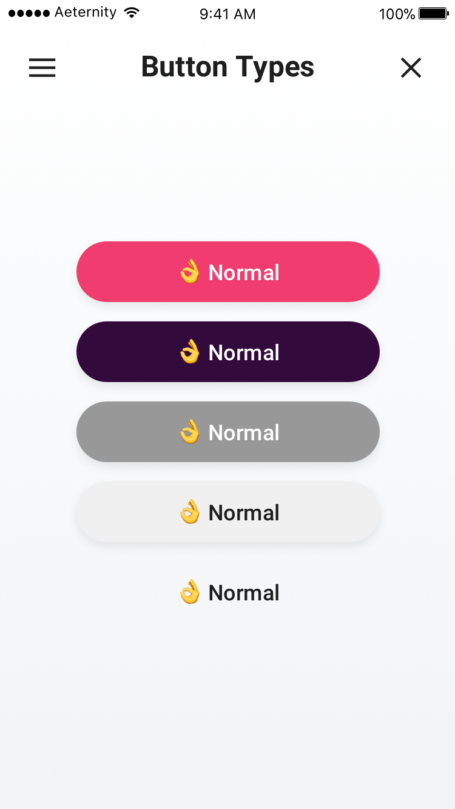
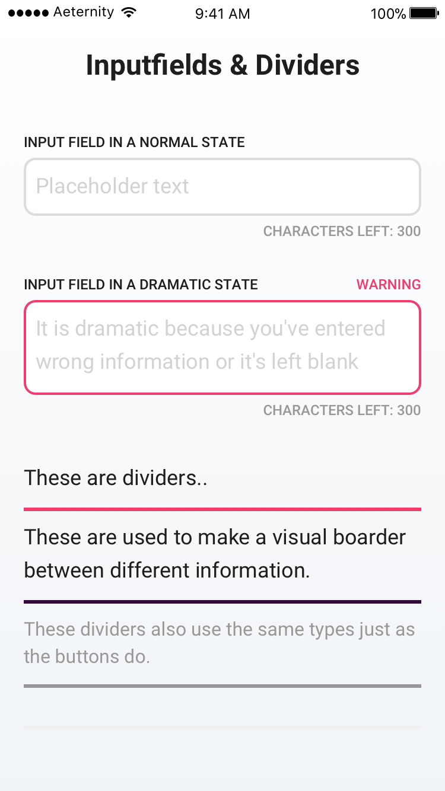
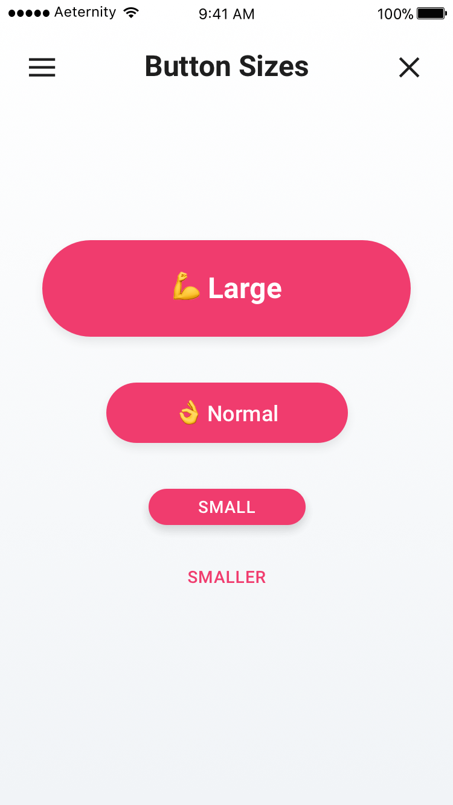

# Welcome to the Æternity Prototypes

We publish concepts and prototypes of æpps that will run on the æternity blockchain. We work in with an iterative process that is build up by sprints, which last two weeks each. We document our progress and results per sprint. We encourage designers and developers to join the community.

📱 Our æpps are designed mobile first  
📖 Everything we build is open source

---

# Getting started as a developer
Developers can make use of the existing open source æpps components and tools in the development repositories below.
💳 [Æpp Identity](https://github.com/aeternity/aepp-identity)  
📝 [Æpp Voting](https://github.com/aeternity/aepp-voting)  
🚀 [Æpp Aexistence](https://github.com/aeternity/aepp-aexistence)  
🙋‍ [Æpp Conversational Machine](https://github.com/aeternity/aepp-conversational-machine)  
🛠 [Æpp Components](https://github.com/aeternity/aepp-components)  

---

# Getting started as a designer
Designers can make use of the styleguide and shared styles for Sketch. Read below how to get started.

## Make use of the æternity Sketch Styleguide
Use our styleguide as a library in order to quickly make use of æternity's UI elements. Download our [Styleguide](00-aepp-styleguides/00-aepp-styleguide.sketch) and set it up as a Library in your own Sketch file or keep track of changes with the Kactus app:

Use the Mac App and the Sketch Plugin [Kactus](https://github.com/kactus-io/kactus), make a branch, keep track of changes and create pull requests of this repository.

or

Create a new Sketch File, but use our Symbols as a [Styleguide](00-aepp-styleguides/00-aepp-styleguide.sketch) using the Sketch Library function. [Learn more about libraries](https://www.sketchapp.com/docs/libraries/adding-libraries)

## Make use of the shared text styles in Sketch
1. Save the [Æternity Text Styles](00-aepp-styleguides/aepp-text-styles.json) locally  
2. Use the [Shared Style Guide Sketch Plugin](https://github.com/nilshoenson/shared-text-styles), install the plugin and import the Æternity Shared Text Style you just downloaded.

## Take a look at our designed æpps until now:
💳 **Æpp Identity**: [Designs](01-aepp-identity) | [Demo æpp](http://identity.aepps.com/)  
✍️ **Æpp Message Wall**: [Designs](02-aepp-message-wall) | [Demo æpp](https://wall.aepps.com/)  
🚀 **Æpp Notary**: [Designs](03-aepp-notary) | [Demo æpp](http://notary.aepps.com/)  
🙋 **Æpp Response**: [Designs](04-aepp-response)  
📝 **Æpp Voting**: [Designs](05-aepp-voting) | [Demo æpp](https://vote.aepps.com/)  

---

# Results Last Sprint (05)

## 1. We developed a Styleguide which helps designers to get started
Which will be updated here when any changes will be made.

## 2. We developed a design structure
We have developed a structure in our elements that should be used consistently throughout all æpps and affects different UI elements, such as **buttons**, **dividers**, **notifications** and other elements. In this structure we made a difference in importance of all the elements and is divided in types:

* dramatic (changing/disrupting actions or potentially harmful)
* exciting (makes user click fast in a guided process)
* normal (default, change view, one of many options on a screen)
* boring (alternative actions, not too much focus)
* plain (no focus)

### Different types - Buttons
A screen with a collection of buttons in all different varieties.

### Different types - Input fields & Dividers
Input fields and dividers also can make use of the different types, which are used by the buttons. Input fields use a normal and a dramatic state, dividers can be used in all states.

### Buttons in different sizes
All the different types comes in different sizes as well. We advice to use the medium button as a default and the large buttons only in web or tablet æpps. The different sizes are describes as below:
* smaller (small, but no background)
* small
* medium (default)
* large

### Text styles
All the different text styles can be found in the JSON [shared text file](00-aepp-styleguides/aepp-text-styles.json).

### Dependencies
👾 These Sketch Plugins are required to get started as a designer
* [Kactus](https://github.com/kactus-io/kactus)
* [Shared Text Styles](https://github.com/nilshoenson/shared-text-styles)
* [Anima App](https://animaapp.github.io/)
* [Symbol Organizer](https://github.com/sonburn/symbol-organizer)

---

# Results previous sprints

## Results Sprint 02
[Sprint 02 – A complete walkthrough through the æpps](sprint-02-release/main.md)

## Results Sprint 01
[Sprint 01 – Our initial ideas](sprint-02-release/sprint_01/main.md)
