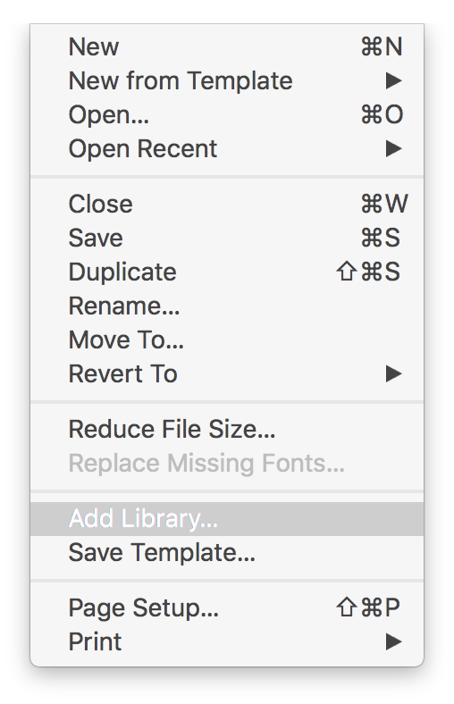
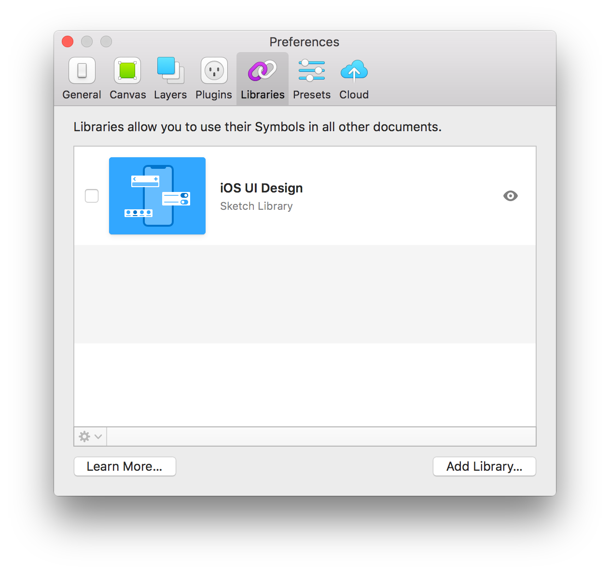
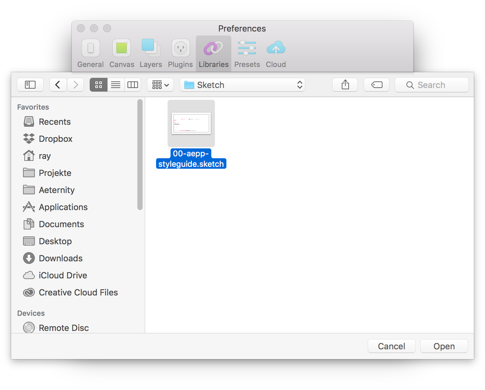
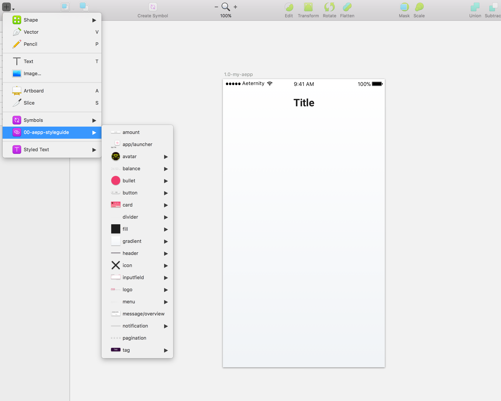
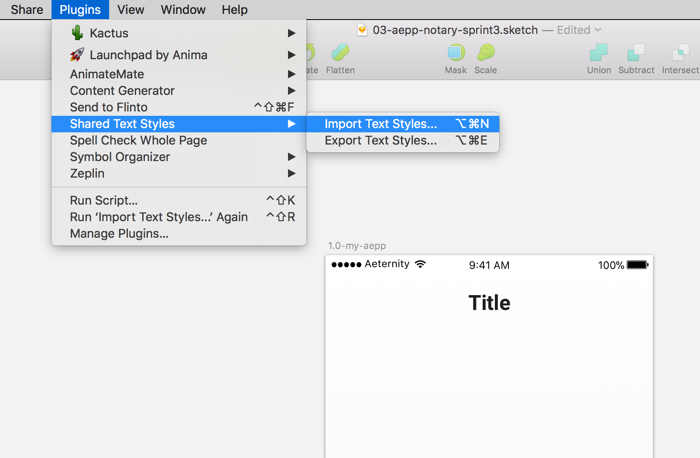
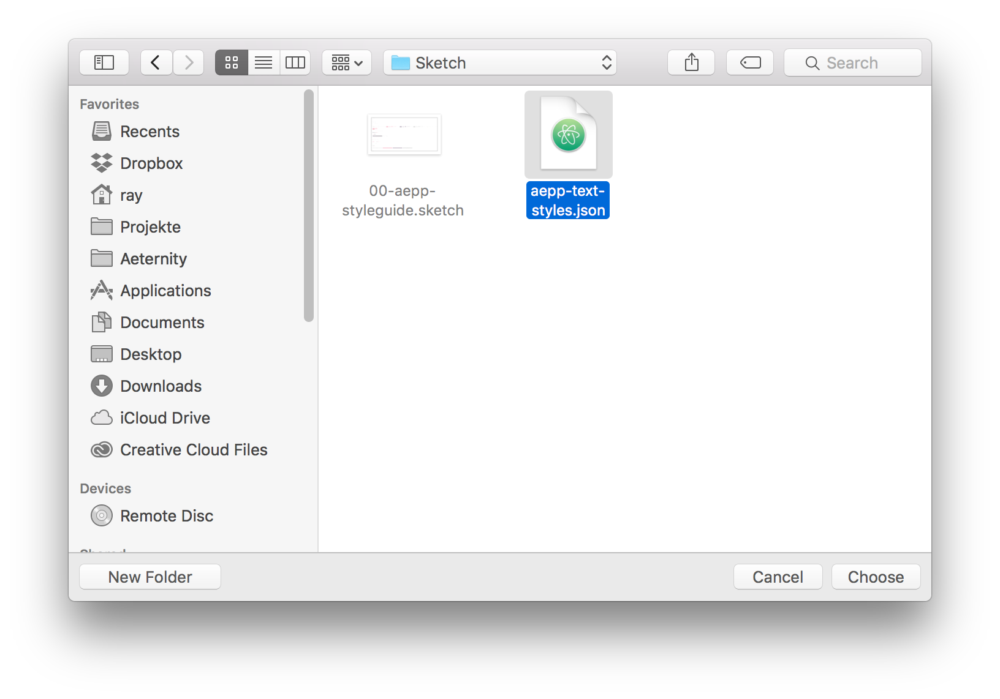
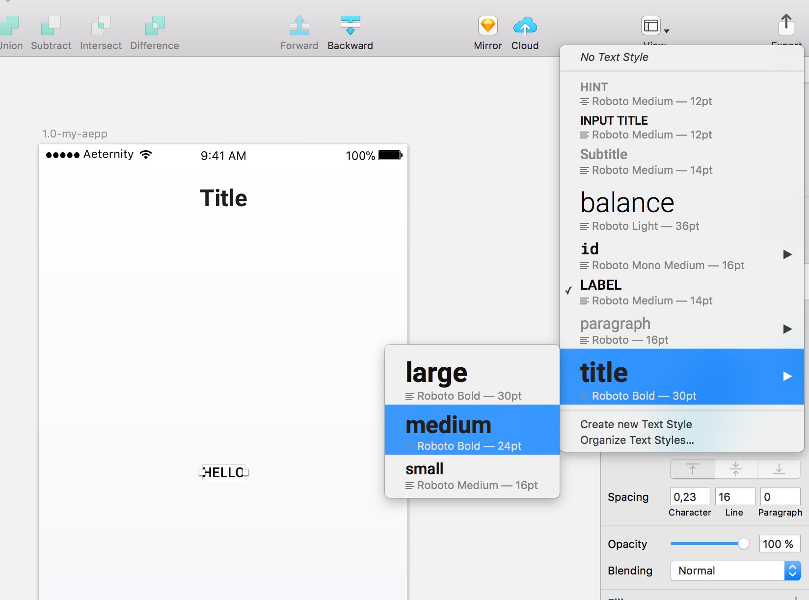
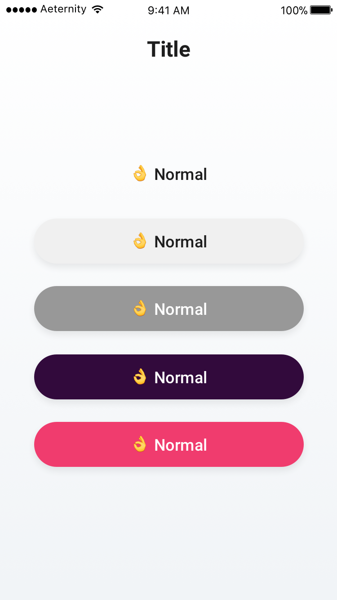
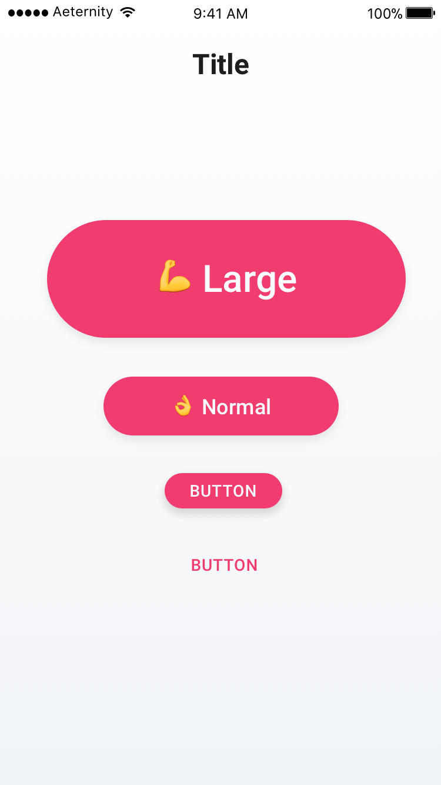

# Welcome to Æternity Prototypes
We publish concepts and prototypes of æpps that will run on the æternity blockchain. We work in with an iterative process that is build up by sprints, which last two weeks each. Here we document our progress and results.

📱 Our æpps are designed mobile first.
📖 Everything we build is open source

---

# Sprint 03 Release
In this sprint we made our workflow transparent and easier for other designers and developers to join the community and start creating together. We've created a single styleguide in Sketch and exported all the used text styles into an importable JSON file. Both can be imported into your Sketch file, in order to instantly start designing with æternity's UI elements and text styles.

## Getting started with the styleguide
Use our styleguide as a library in order to quickly make use of æternity's UI elements.

### 💻 1. Save the [Styleguide](/00-aepp-styleguide.sketch) locally
This file contains all the UI elements we have been using in our æpps.

### 📚 2. Create a new Sketch file and add a library
File > Add Library

### 📚 3. Use the library in Sketch
All the UI elements from the [styleguide](/00-aepp-styleguide.sketch) should now be available in your Sketch file. To add single elements, click 'Insert' and choose a desired element from the 00-aepp-styleguide.

---

## Getting started with our Shared Styles
Use our text styles that we have been using in our æpps until now.

### 💻 1. Save the [Æternity Text Styles](/aepp-text-styles.json) locally
This file contains all the text styles we have been using in our æpps.

### 🛠 2. Download and install the Shared Text Styles Plugin
This plugin gives you the possibility to import the JSON file in Sketch.
[Shared Text Styles](https://github.com/nilshoenson/shared-text-styles)

### 💾 3. Import Shared Text Styles in Sketch
Plugins > Shared Text Styles > Import Text Styles

### 📝 4. Use Shared Text Styles in Sketch
Now every shared style should be available in your Sketch file

---

## Explanation of the different elements
We have developed a structure in our elements that should be used consistently throughout all æpps and affects different UI elements, such as **buttons**, **dividers**, **notifications**, ... This structure defines the importance of all the elements and is divided in types:
* plain (no focus)
* boring (alternative actions, not too much focus)
* normal (default, change view, one of many options on a screen)
* exciting (makes user click fast in a guided process)
* dramatic (changing/disrupting actions or potentially harmful)

### Buttons in different types
A screen with a collection of buttons in all different varieties.

### Buttons in different sizes
All the different types comes in different sizes as well. We advice to use the medium button as a default and the large buttons only in web æpps. The different sizes are describes as below:
* smaller (small, but no background)
* small
* medium (default)
* large

A screen with a collection of **dramatic buttons** in all different sizes:

### Dependencies
👾 These Sketch Plugins are required to import our text styles
* [Shared Text Styles](https://github.com/nilshoenson/shared-text-styles)

# Sprint 02 Release

## Base æpp & Identity manager
Get in touch with the aeternity blockchain.

[🚀 Get started](base-aepp/base.md#-get-started)

[✨ Create account](base-aepp/base.md#-create-account)

[💳 Manage identities](base-aepp/base.md#-manage-identities)

[👀 Aepp browser](base-aepp/base.md#-aepp-browser)

[💸 Transfer tokens](base-aepp/base.md#-transfer-tokens)

[🤞 Switch identities](base-aepp/base.md#-switch-identities)

[🤳 Sidemenu](base-aepp/base.md#-sidemenu)

***

[Dev repository](https://github.com/aeternity/aepp-identity)

## Message Wall
Write and read and support æternal messages, thoughts and ideas.

[💻 Browse the wall](base-aepp/wall.md#-browse-the-wall)

[✍ Write messages](base-aepp/wall.md#-write-messages)

[🔒 Confirm messages](base-aepp/wall.md#-confirm-messages)

[👏 Reward authors](base-aepp/wall.md#-reward-authors)

***

[Dev repository](https://github.com/aeternity/aepp-wall)

## Notary
Create undeniable proofs of the existence of a file.

[🗂 Notary overview](base-aepp/notary.md#-notary-overview)

[📃 Create proofs](base-aepp/notary.md#-create-proofs)

[👀 View originals](base-aepp/notary.md#-view-originals--open-receipts--compare-files--share-links)

[📄 Open receipts](base-aepp/notary.md#-view-originals--open-receipts--compare-files--share-links)

[👐 Compare files](base-aepp/notary.md#-view-originals--open-receipts--compare-files--share-links)

[👉 Share links](base-aepp/notary.md#-view-originals--open-receipts--compare-files--share-links)

***

[Dev repository](https://github.com/aeternity/aepp-aexistence)

## Voting
Submit, comment and vote for change proposals of Æternity tech.

[Dev repository](https://github.com/aeternity/aepp-voting)

# Contributing
👏 If you want to contribute, you have two options:

1. Use the Mac App and the Sketch Plugin [Kactus](https://github.com/kactus-io/kactus), make a branch, keep track of changes and create pull requests of this repository.

or

2. Create a new Sketch File, but use our Symbols as a Styleguide using the Sketch Library function. [Learn more about libraries](https://www.sketchapp.com/docs/libraries/adding-libraries)

### Dependencies
👾 These Sketch Plugins are required to handle the sketch file.
* [Anima App](https://animaapp.github.io/)
* [Symbol Organizer](https://github.com/sonburn/symbol-organizer)

# Index
[Sprint 01 – Our initial ideas](base-aepp/sprint_01/main.md)
