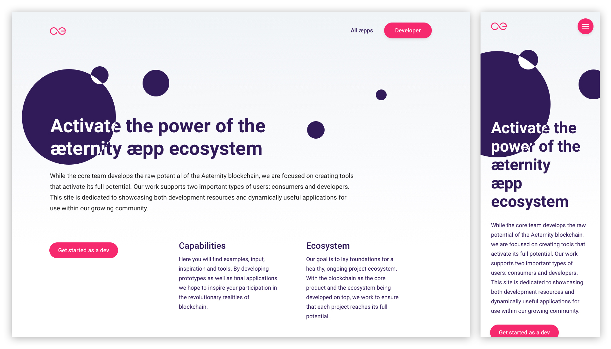
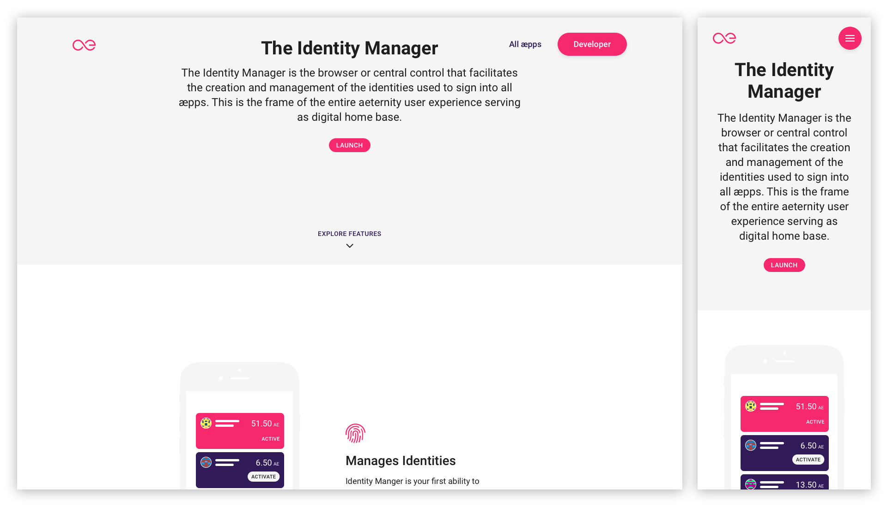
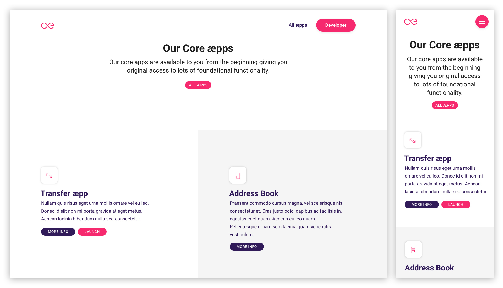
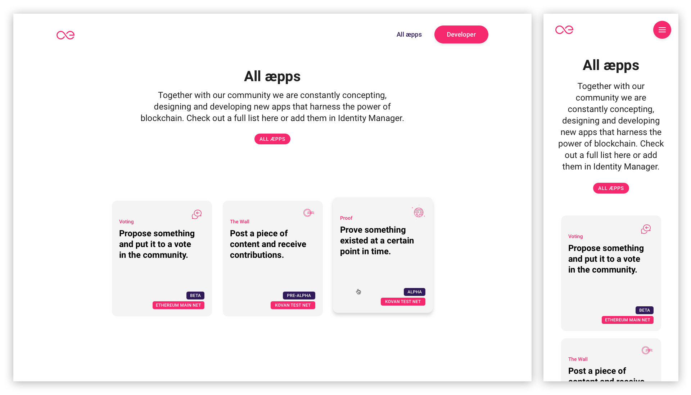
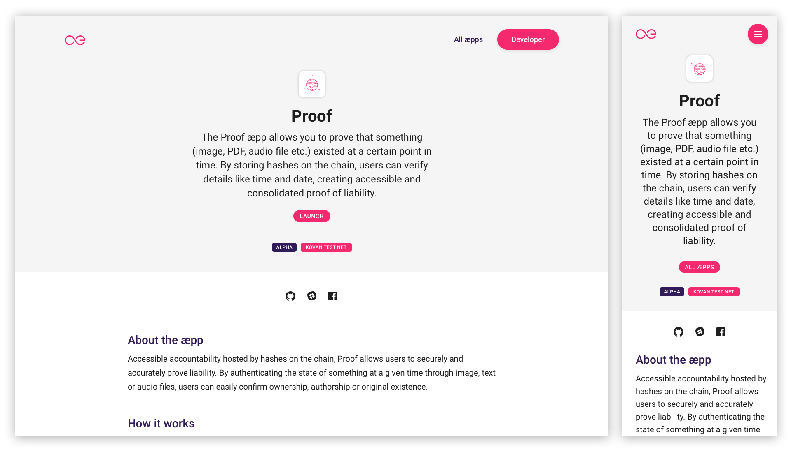
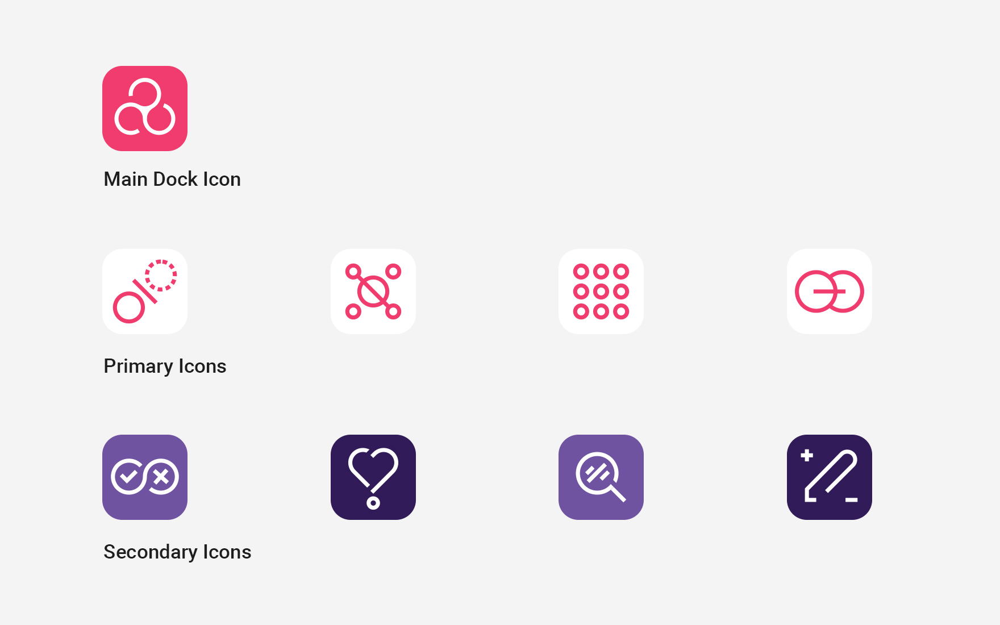
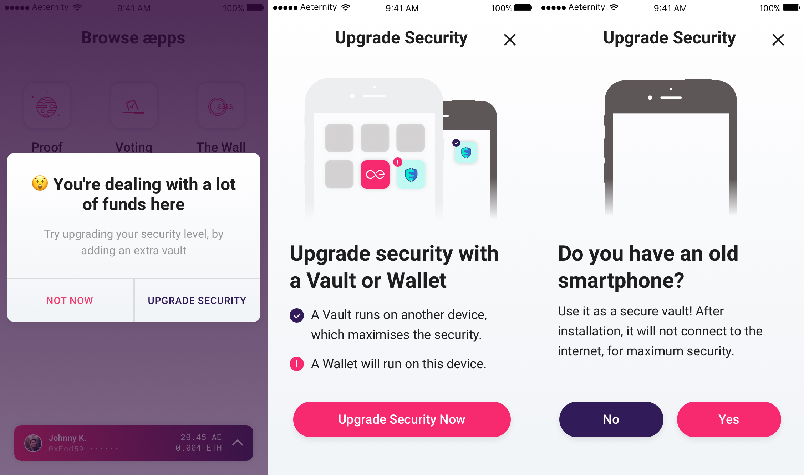
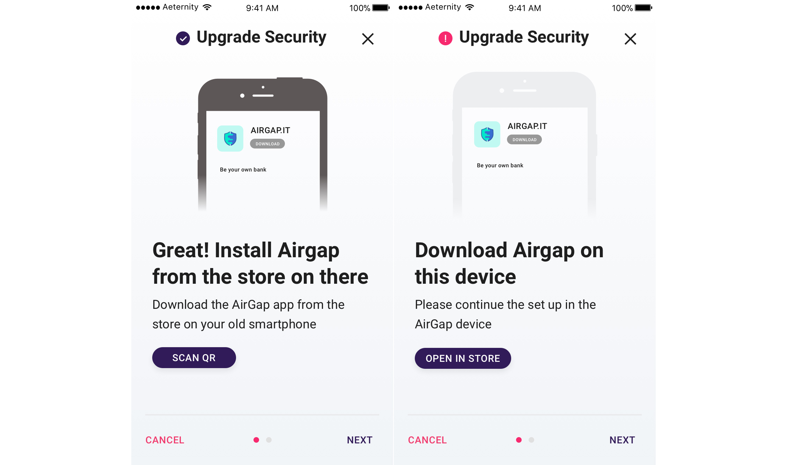

# Welcome to the æternity Prototypes
We publish concepts and prototypes of æpps that will run on the æternity blockchain. We work in with an iterative process that is build up by sprints, which last two weeks each. We document our progress and results per sprint. We encourage designers and developers to join the community.

📱 Our æpps are designed mobile first
📖 Everything we build is open source

## Quick access designs and styles in Zeplin
All the designs are frequently updated in Zeplin Styleguide, where all the CSS Styles can be viewed. To receive access to the styleguide and the designs, send a request with your email address you used for your [Zeplin](https://zeplin.io/) account to ray@apeunit.com.

---

# Getting started as a developer
Developers can make use of the existing open source æpps components and tools in the development repositories below.
💳 **æpp Identity**: [Dev Repo](https://github.com/aeternity/aepp-identity)
🚀 **æpp Notary**: [Dev Repo](https://github.com/aeternity/aepp-aexistence)
🙋‍ **æpp Conversational Machine**: [Dev Repo](https://github.com/aeternity/aepp-conversational-machine)
📝 **æpp Voting**: [Dev Repo](https://github.com/aeternity/aepp-voting)
🛠 **æpp Components**: [Dev Repo](https://github.com/aeternity/aepp-components)

---

# Getting started as a designer
Designers can make use of the styleguide and shared styles for Sketch. Read below how to get started.

## Make use of the æternity Sketch Styleguide
Use our styleguide as a library in order to quickly make use of æternity's UI elements. Download our [Styleguide](00-aepp-styleguides/00-aepp-styleguide.sketch) and set it up as a Library in your own Sketch file or keep track of changes with the Kactus app:

Use the Mac App and the Sketch Plugin [Kactus](https://github.com/kactus-io/kactus), make a branch, keep track of changes and create pull requests of this repository.

*or*

Create a new Sketch File, but use our Symbols as a [Styleguide](00-aepp-styleguides/00-aepp-styleguide.sketch) using the Sketch Library function. [Learn more about libraries](https://www.sketchapp.com/docs/libraries/adding-libraries)

## Make use of the shared text styles in Sketch
1. Save the [æternity Text Styles](00-aepp-styleguides/aepp-text-styles.json) locally
2. Use the [Shared Style Guide Sketch Plugin](https://github.com/nilshoenson/shared-text-styles), install the plugin and import the æternity Shared Text Style you just downloaded.

## Take a look at our designed æpps until now:
💳 **æpp Identity**: [Designs](01-aepp-identity) | [Demo æpp](http://identity.aepps.com/)
✍️ **æpp Message Wall**: [Designs](02-aepp-message-wall) | [Demo æpp](https://wall.aepps.com/)
🚀 **æpp Notary**: [Designs](03-aepp-notary) | [Demo æpp](http://notary.aepps.com/)
🙋 **æpp Response**: [Designs](04-aepp-response)
📝 **æpp Voting**: [Designs](05-aepp-voting) | [Demo æpp](https://vote.aepps.com/)

---

# Results Last Sprint (08)

## 1. We redesigned the website aepps.com
Which will be a starting point for both consumers and developers. **Consumers** can discover possibilities of Blockchain (æternity in particular) by trying out decentralized æpps. Developers will be able to get inspired by the æpps as well, but also be able to 'Get Started' by visiting [dev.aepps.com](http://dev.aepps.com).

The new version will be an update of [the old version](http://aepps.com).

### The homepage
* Starts with an introduction text that addresses both consumers and developers.
* Developers have the possibility to instantly get started, or scroll down to explore the identity manager and the æpps more.
* We assume that consumers are more interested in the consumer facing æpps, therefor these are shown on the homepage.

### æpp Single Page
* Every æpp has a detailed page, where we explain the æpp more with: idea behind the æpp, the future possibilities, screenshots, links to github, etc.

---

## 2. We started to a design concept for the æpp icons
We clearly have a hierarchy in the different icons:
1. The Identity Manager is the Base æpp, where 2. & 3. can be done.
2. Core æpps are 'pre-installed' and instantly available for the user in order to make use of æternity's core functionalities, such as 'Transfer', 'Messages', 'Address Book' and the 'Blockchain Explorer'.
3. The latest are Use Case æpps, which show the (endless) possibilities of decentralized æpps.

### Base æpp
Built on the same concept of the logo. The main idea behind this is using a very simple symbol to represent the “operative system” which is able to stand alone and yet be reconnected to the æternity brand. The metaphor of the identity being a circle, and the triad signifies movement and change as the user switches between his identities.

### Primary Icons
Very minimal and using only circular shapes and lines, as per in the æternity logo. The idea is to use the pink for the main icon, and invert the colors on the Primary Services Icons. This way, the color still helps you understand that you are looking at one of the core apps.

### Secondary Icons
For these icons we would allow more flexibility for the designs, being able to use more complex and more figurative symbols (while still keeping the simplicity of the overall designs.

---

## 3. We started the UX concept for an offline signing functionality
Which prevents the private key from is ever being used on a device that is connected to the internet, in order to minimize the change of losing funds.

1. The user is being prompted that he is dealing with a lot funds, an that he should consider installing a cold wallet
2. With a simple question like: "Do you have an old smartphone?", we try to explain the advantage of a cold wallet.
3. If the user doesn't have an old smartphone, he has the option to install the wallet on the same phone (with a lower security)

---

# Results previous sprints

## Results Sprint 07
[Sprint 07 – We build a blockchain explorer on æternity's test net](sprint-07-release/main.md)

## Results Sprint 05
[Sprint 05 – We developed a design structure](sprint-05-release/main.md)

## Results Sprint 02
[Sprint 02 – A complete walkthrough through the æpps](sprint-02-release/main.md)

## Results Sprint 01
[Sprint 01 – Our initial ideas](sprint-02-release/sprint_01/main.md)
