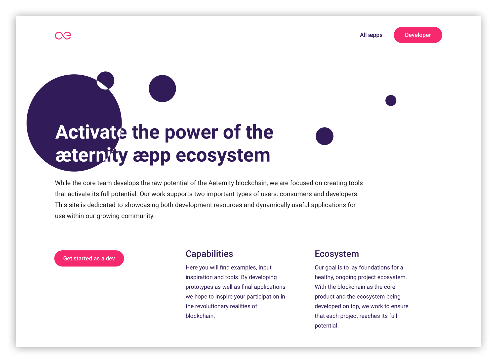
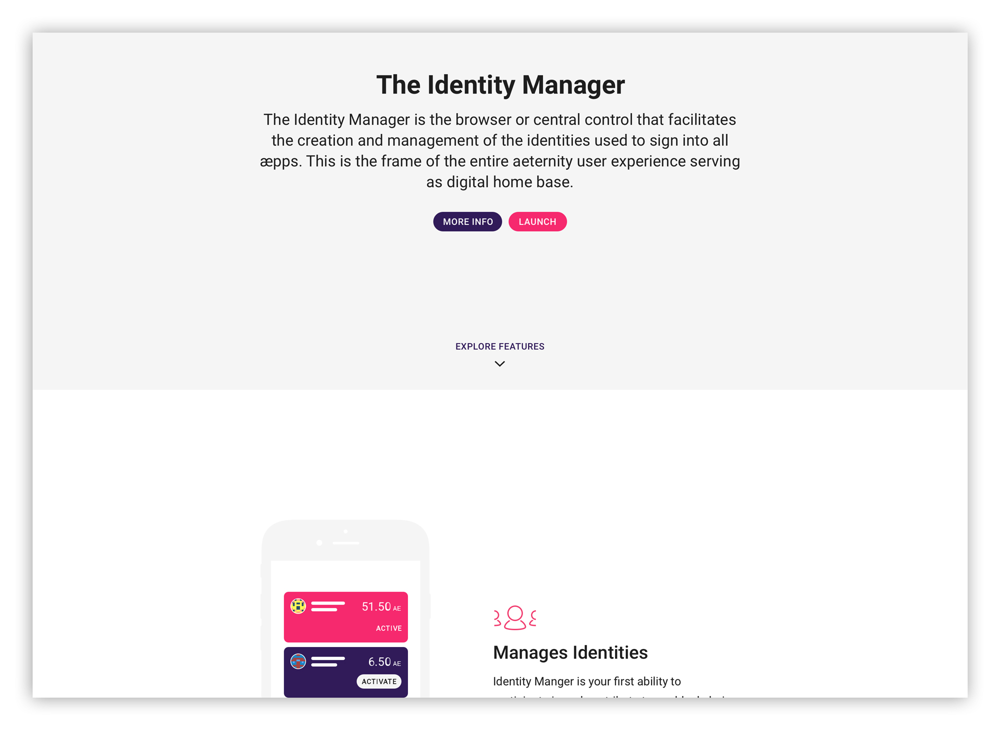
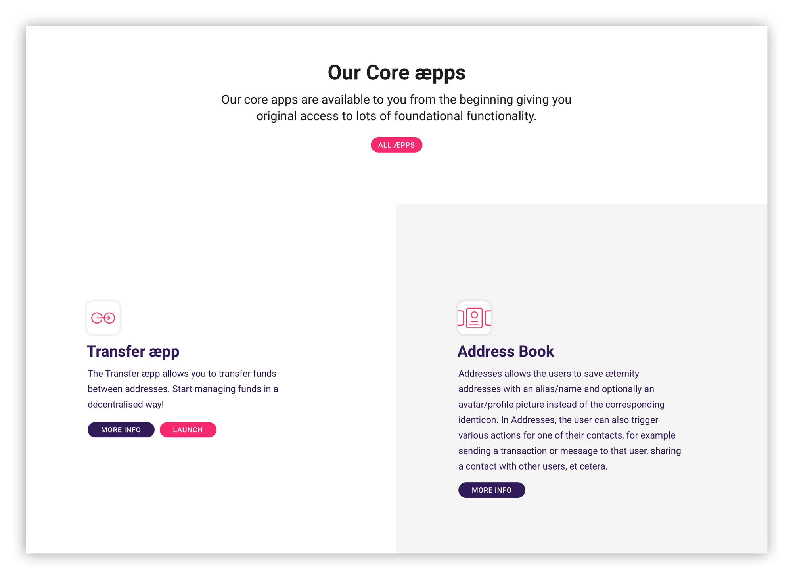
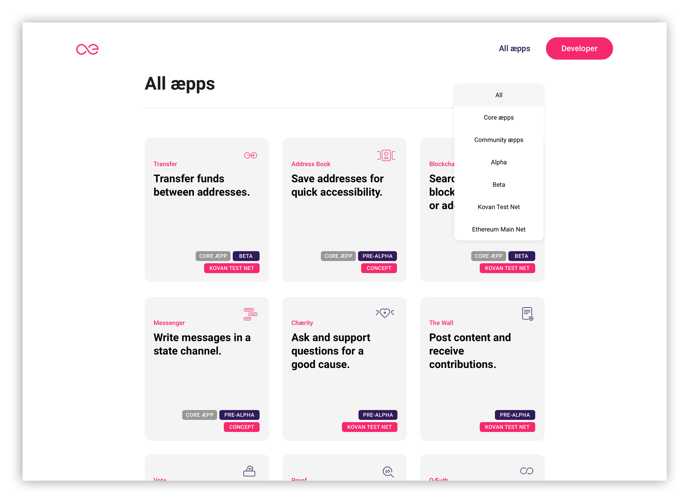
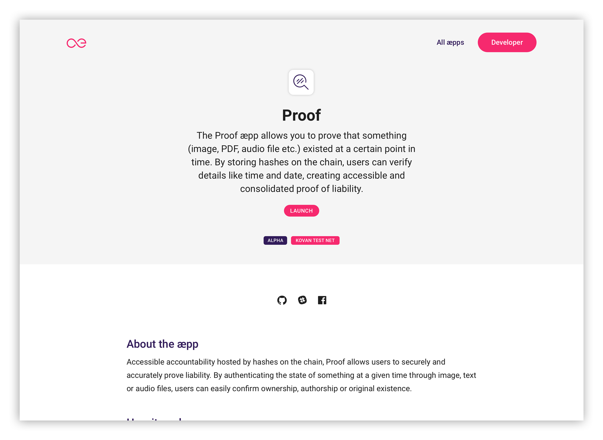
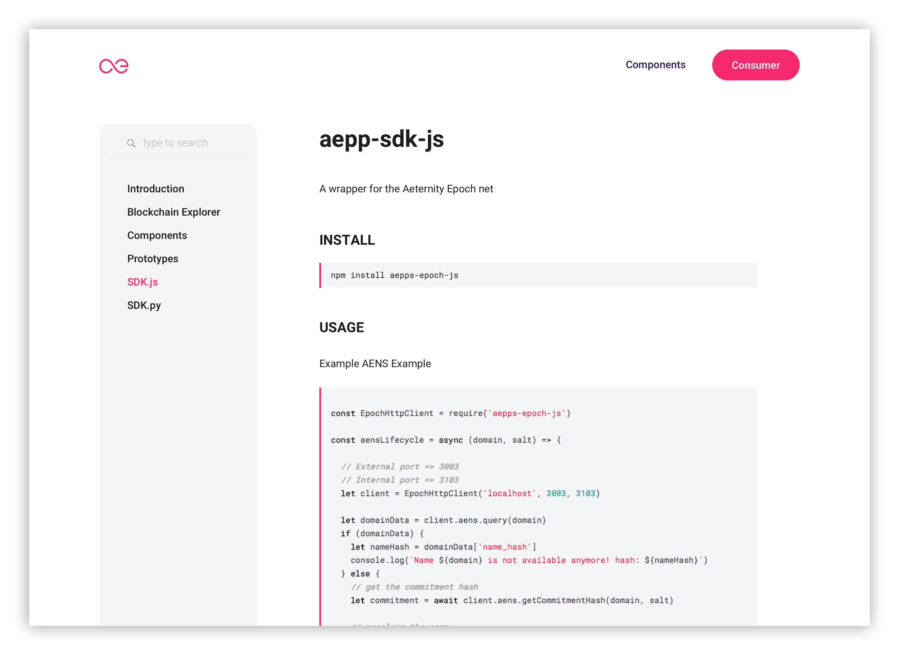
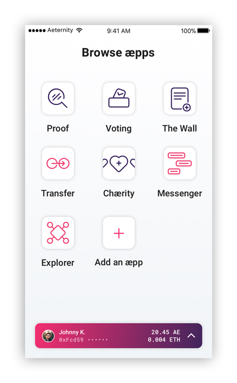

# æternity Prototypes

## Overview
These are concepts and prototypes of æpps that will run on the æternity blockchain. They can be found in the [github repository](https://github.com/aeternity/aepp-prototypes).

We work in an iterative process consisting of two week [sprints](http://searchsoftwarequality.techtarget.com/definition/Scrum-sprint), each lasting 2 weeks.

We document our progress and results per sprint here. We encourage designers and developers to join the community by contributing pull requests.

📱 Our æpps are designed mobile first.
📖 Everything we build is open source.

## Quick access designs and styles in Zeplin
All the designs are frequently updated in Zeplin Styleguide, where all the CSS Styles can be viewed. To receive access to the styleguide and the designs, send a request with your email address you used for your [Zeplin](https://zeplin.io/) account to ray@apeunit.com.

---

## Getting started as a developer
Developers can make use of the existing open source æpps components and tools in the development repositories below.

💳 **æpp Identity**: [Dev Repo](https://github.com/aeternity/aepp-identity)

🚀 **æpp Notary**: [Dev Repo](https://github.com/aeternity/aepp-aexistence)

🙋‍ **æpp Conversational Machine**: [Dev Repo](https://github.com/aeternity/aepp-conversational-machine)

📝 **æpp Voting**: [Dev Repo](https://github.com/aeternity/aepp-voting)

🛠 **æpp Components**: [Dev Repo](https://github.com/aeternity/aepp-components)

---

# Getting started as a designer
Designers can make use of the styleguide and shared styles for Sketch. Read below to see how to get started.

## Make use of the æternity Sketch Styleguide
Use our styleguide as a library in order to quickly make use of æternity's UI elements.

Install [Kactus](https://github.com/kactus-io/kactus), clone the repository, keep track of changes, create a branch, and create pull requests to merge your branch into master.

Kactus will automatically create `.sketch` files from the directories in this repository. Set up the generated `00-aepp-styleguide.sketch` as a Library in your Sketch preferences.

[Learn more about libraries](https://www.sketchapp.com/docs/libraries/adding-libraries)

## Make use of the shared text styles in Sketch
1. Save the [æternity Text Styles](00-aepp-styleguide/document.json) locally
2. Use the [Shared Style Guide Sketch Plugin](https://github.com/nilshoenson/shared-text-styles), install the plugin and import the æternity Shared Text Style you just downloaded.

## Take a look at the æpps we have already made
💳 **æpp Identity**: [Designs](01-aepp-identity) | [Demo æpp](http://identity.aepps.com/)

✍️ **æpp Message Wall**: [Designs](02-aepp-message-wall) | [Demo æpp](https://wall.aepps.com/)

🚀 **æpp Notary**: [Designs](03-aepp-notary) | [Demo æpp](http://notary.aepps.com/)

🙋 **æpp Response**: [Designs](04-aepp-response)

📝 **æpp Voting**: [Designs](05-aepp-voting) | [Demo æpp](https://vote.aepps.com/)

---

# Results of last Sprint (09)

## 1. We developed aepps.com and dev.aepps.com
We have developed aepps.com that addresses both consumers and developers.

### Consumer side
The consumer side of the website functions as an introduction to the æternity project and mostly what kind of use cases can be solved with blockchain. This in the form of a showcase, where we differentiate between the aepp hierarchy.
* Identity Manager
* Core æpps (Transfer, Address Book, Blockchain Explorer, Messenger)
* Use Case æpps

**Home**

**All æpps**

**Single æpp**

### Developer site
The developer site is the place where developers can get learn how to get started developing æpps for the æternity blockchain. It contains all the documentation and links to the Github repositories a developer needs for to get started.

**Get Started Guide**

## 2. We finalized the design of all the æpp icons
We finalized the æpp icon which we have started in the previous sprint. We clearly have a hierarchy in the different icons:
1. The Identity Manager is the Base æpp, where 2. & 3. can be done.
2. Core æpps are 'pre-installed' and instantly available for the user in order to make use of æternity's core functionalities, such as 'Transfer', 'Messages', 'Address Book' and the 'Blockchain Explorer'.
3. The latest are Use Case æpps, which show the (endless) possibilities of decentralized æpps.

## 3. We finalized the concept for offline signing with Airgap
We have finalized the concept for offline signing which we started in the previous sprint.
[See Clickdummy](https://projects.invisionapp.com/share/JTFUTDQWEFN#/screens)!

---

# Results previous sprints

## Results Sprint 08
[Sprint 08 – We redesigned aepps.com, created new aepp icons, started the UX concept for offline signing](sprint-08-release/main.md)

## Results Sprint 07
[Sprint 07 – We build a blockchain explorer on æternity's test net](sprint-07-release/main.md)

## Results Sprint 05
[Sprint 05 – We developed a design structure](sprint-05-release/main.md)

## Results Sprint 02
[Sprint 02 – A complete walkthrough through the æpps](sprint-02-release/main.md)

## Results Sprint 01
[Sprint 01 – Our initial ideas](sprint-02-release/sprint_01/main.md)
