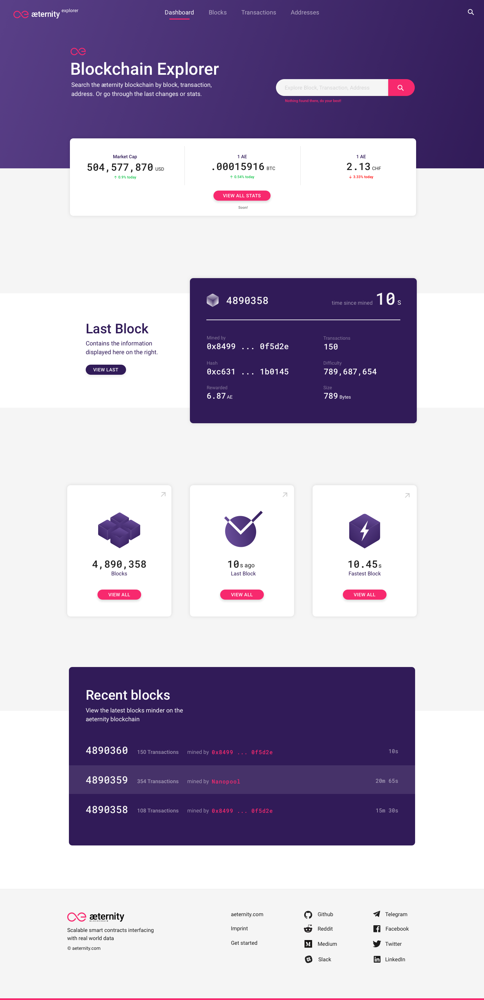
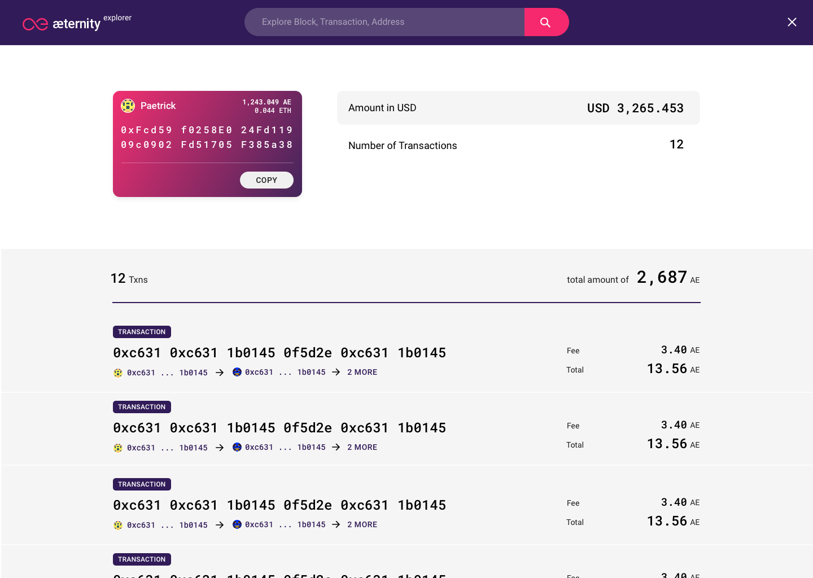

# Welcome to the Æternity Prototypes

We publish concepts and prototypes of æpps that will run on the æternity blockchain. We work in with an iterative process that is build up by sprints, which last two weeks each. We document our progress and results per sprint. We encourage designers and developers to join the community.

📱 Our æpps are designed mobile first  
📖 Everything we build is open source

## Quick access designs and styles in Zeplin
All the designs are frequently updated in Zeplin Styleguide, where all the CSS Styles can be viewed. To receive access to the styleguide and the designs, send a request with your email address you used for your [Zeplin](https://zeplin.io/) account to ray@apeunit.com.

---

# Getting started as a developer
Developers can make use of the existing open source æpps components and tools in the development repositories below.
💳 **Æpp Identity**: [Dev Repo](https://github.com/aeternity/aepp-identity)  
🚀 **Æpp Notary**: [Dev Repo](https://github.com/aeternity/aepp-aexistence)  
🙋‍ **Æpp Conversational Machine**: [Dev Repo](https://github.com/aeternity/aepp-conversational-machine)  
📝 **Æpp Voting**: [Dev Repo](https://github.com/aeternity/aepp-voting)  
🛠 **Æpp Components**: [Dev Repo](https://github.com/aeternity/aepp-components)

---

# Getting started as a designer
Designers can make use of the styleguide and shared styles for Sketch. Read below how to get started.

## Make use of the æternity Sketch Styleguide
Use our styleguide as a library in order to quickly make use of æternity's UI elements. Download our [Styleguide](00-aepp-styleguides/00-aepp-styleguide.sketch) and set it up as a Library in your own Sketch file or keep track of changes with the Kactus app:

Use the Mac App and the Sketch Plugin [Kactus](https://github.com/kactus-io/kactus), make a branch, keep track of changes and create pull requests of this repository.

or

Create a new Sketch File, but use our Symbols as a [Styleguide](00-aepp-styleguides/00-aepp-styleguide.sketch) using the Sketch Library function. [Learn more about libraries](https://www.sketchapp.com/docs/libraries/adding-libraries)

## Make use of the shared text styles in Sketch
1. Save the [Æternity Text Styles](00-aepp-styleguides/aepp-text-styles.json) locally  
2. Use the [Shared Style Guide Sketch Plugin](https://github.com/nilshoenson/shared-text-styles), install the plugin and import the Æternity Shared Text Style you just downloaded.

## Take a look at our designed æpps until now:
💳 **Æpp Identity**: [Designs](01-aepp-identity) | [Demo æpp](http://identity.aepps.com/)  
✍️ **Æpp Message Wall**: [Designs](02-aepp-message-wall) | [Demo æpp](https://wall.aepps.com/)  
🚀 **Æpp Notary**: [Designs](03-aepp-notary) | [Demo æpp](http://notary.aepps.com/)  
🙋 **Æpp Response**: [Designs](04-aepp-response)  
📝 **Æpp Voting**: [Designs](05-aepp-voting) | [Demo æpp](https://vote.aepps.com/)  

---

# Results Last Sprint (06)

## 1. We created a Blockchain Explorer for the Æternity Test Net
Which is a web tool that provides detailed information about blocks, addresses, and transactions made on the Æternity Test Net. It is mainly aimed at advanced users who already know what blocks are and what kind of information they contain. As our goal is to make the Blockchain more accessible for the mass, we designed a certain hierarchy in the visual representation of the different layers. (1) Blocks contain transactions, (2) transactions are interactions between addresses, (3) addresses contain user-specific information.

You can visit the working version [here](https://explorer.aepps.com/)

### The Dashboard
* Starts with a prominent placed introduction text and a universal search bar, so users can instantly search for that what they're looking for without goint through the page
* Displays the stats from the market, such as market cap and exchange rate, so users instantly get an understanding of the size and positioning of Æternity
* Displays detailed information about the last mined block, so users can quickly scan the latest update on the chain
* Displays the last tree blocks and most important information, so users have an understanding of the recent progress of the blockchain

### Blocks overview
* Displays the last 10 blocks, with most important information
* Time since mined is always positioned in the upper right corner, so that the user has an idea of the current

### Block Info
* The general information that about the block is displayed in the purple area
* Within this purple area the user can navigate back and forth in the chain of blocks
* The transactions are listed in the grey area below, with transaction information such as fee, total amount, addresses, and the kind of transaction displayed as a label.

### Transaction Info
* The general information that about the block is still displayed in the purple area
* The transactions are listed in the grey area below, with information per transaction such as fee, total amount, addresses, and the kind of transaction displayed in a clear label.

### Address Info
* Clicking on an address anywhere in the blockchain explorer leads to the detailed address information
* Here are the details of the address listed, such as amount, number of transactions, latets transactions.

---

## 2. We started the concept/design of the decision maker æpp
The decision maker is an æpp that lets users create documents (decisions) based on a meeting that has been taken place. The author can create notes from this meeting and invite the people that took part of the meeting. When every attendee agreed to a note (quote, short text, ..), the note is closed and an agreement has took place and everyone should commit to that.  

**This is a first draft of the concept and will be updated in the following sprint**

### New Session
* A new session can be started with a big button, for starting the audio.
* After finishing the audio session, other attendees can be added directly.

### Session and single card
* A session can contain multiple cards (texts, that people need to accept), here the user sees which ones are closed and agreed upon and which ones are in need of attention.
* A single card can

---

# Results previous sprints

## Results Sprint 05
[Sprint 05 – We developed a design structure](sprint-05-release/main.md)

## Results Sprint 02
[Sprint 02 – A complete walkthrough through the æpps](sprint-02-release/main.md)

## Results Sprint 01
[Sprint 01 – Our initial ideas](sprint-02-release/sprint_01/main.md)
