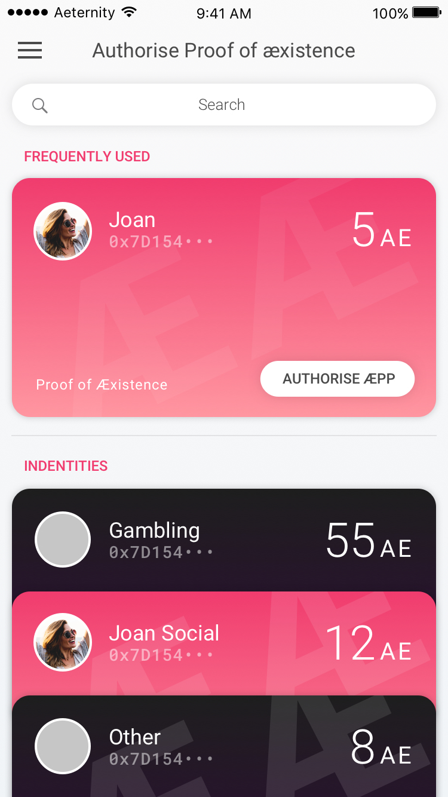
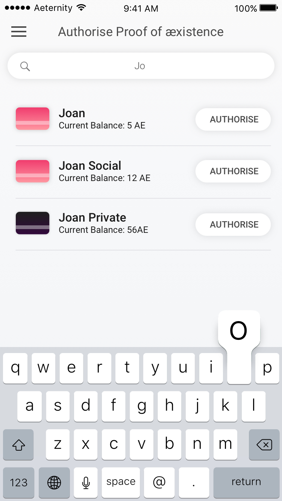

# Aepp Authorization

This is the authorisation part of the Identity Manager, where the user lands when another æpp requires an authorisation and the user already has created identities. It’s the formiliar list view of all the Identities.
# Authorise an aepp

Authorisation part, scrolled down.

---

Authorisation part, but where the user has searched for a certain identity. A more compact list view is shown. Clicking on authorise will lead the user to 12.4

---

To confirm the request to authorise another æpp, the user needs to securely approve it with (for instance) the touch id in ios.

# Go back to Proof of Aexistence
[Jump to: Authorization](proof-of-aexistence.md#create-a-proof)
