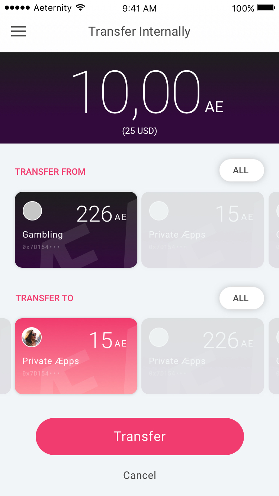

# Manage Identities

A user can have multiple Identities, each identitiy has a token balance. An æepp with access to a specific identitiy has full control of the balance and can use the æternity tokens of this identitiy. A user can authorise multiple æpps to use one identity.

Identities can be private or public, as explained in the [onboarding](onboarding.md), and are represented as cards.

## Dashboard

The Dashboard is an overview of the following items:
1.	**Identities**: The first card is a combined view of all identities, swiping to the right shows more cards, which represent the most frequently used identities.
1.	**Balance Summary of the last week**, this information depends on the selected card.
1.	**Recent transactions**, from the selected card.
1.	**Currency History** shows the changes in fiat value of AET.

When a specific identity is selected in the Dashboard, only transactions from it are shown.

---

A sidemenu provides access to additional functionality.

## My Identities

This is the area where the user can manage identities and access the detail view of a specific identity.

A list view of all identities. The most frequently used identities are shown at the top.

---

All Identities, scrolled down.

---

When the user taps the search field and enters an identity name, a matching results list is shown. This is handy when a user has a lot of identities.

---

The detail view of an identity is similar to the Dashboard, with the following additional items: Authorized æpps and a graph that shows the recent balance of this identity.

---

An authorised æpp has been selected. In this view the user sees the transactions, which were made by the authorized æpp. The user has the option to revoke æpp authorisation.

---

## Transfer Tokens between Identities

---

The user can make internal transactions here. In the upper area the user can add an amount of AE Tokens. ‘Transfer from’ shows the identity where the transfer is coming from. ‘Transfer to’ shows the identity which will receive the tokens transfer.

---

---

---

## Revoke authorization
If a user has a lot of different identities, they might lose track of which æpp has access to which identity. In this case they might search for a specific æpp to review the transactions and revoke its authorisation. 

Sidemenu, when Authorised æpps is the current view.

---

A list of all authorized æpps. Clicking on each identity shows its details.

---

This view lists all the transactions, made by an authorized æpp (connected to a given identity). The user has the option to revoke authorization. This is the same view as 4.6.
