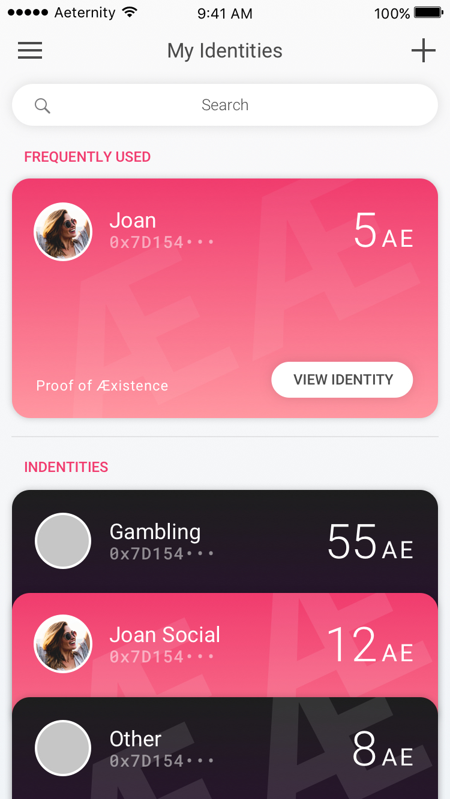
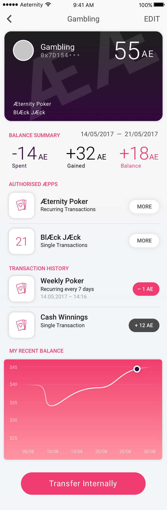

# Manage Identities

TODO: Explain the basic concept of Identities, Master and Subkeys here.

## Dashboard

The Dashboard is an overview of the following items:
1.	Identities: First card is all identities combined, swiping to the right shows more cards, they represent the most frequently used identities.
1.	Balance Summary of the last week, these information depends which card is selection in 1.
1.	Recent transactions: also depending on which identity is selected in 1.
1.	Currency History shows the value of the AE

The Dashboard when another Identity is selected

---

Sidemenu, Dashboard is active

## My Identities

A listview of all identities, the frequently used is shown on top.

---

Sidemenu, My Identities is active

---

All Identities, scrolled down.

---

When the user taps the search field and enters an identity name, a more compact list is shown. This is useful when the user has a lot identities.

---

The details of an identity is similar to the Dashboard, extra items are added: Authorised æpps and a graph that shows the recent balance of this certain Identity.

---

An  authorised æpp has been selected. In this detailed view the user sees the transactions that are made with the authorised æpp. The user has the option to revoke authorisation.

## Transfer Tokens between Identities

The user can make internal transactions here. In the upper area the user can add an amount of AE Tokens. ‘Transfer from’ shows the identity where the transfer is coming from. ‘Transfer to’ shows the identity which will receive the transaction.

---

Sidemenu, Transfer Internally is active

---

---

The amount is filled in

---

## Authorise an aepp

A list of all authorised æpps. Clicking on it shows details.

---

Sidemenu, Authorised æpps is active

---

In this detail view the user sees the transactions that are made with the authorised æpp. The user has the option to revoke authorisation. It is the same view as 4.6.
