# Onboarding

Our goal is to provide access to the aeternity block chain with ease. Providing all necessary information for users who are unfamiliar with block chain concepts on one Hand. On the other Hand we want experts to be able to jump right into identity creation.
We created a conversational interface to implement this freedom of choice.

## Install Identity Manager

---

Identity Manager is a native app.

## Intro
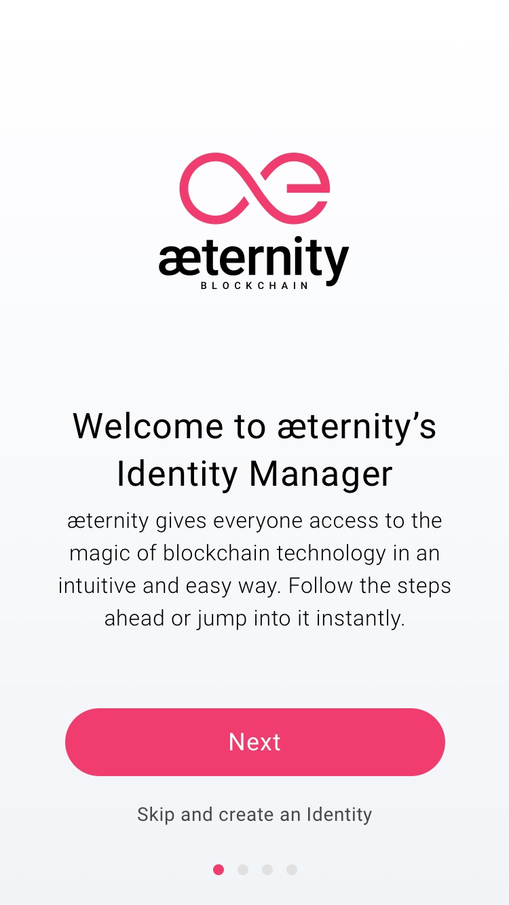

Intro Screen 1 explains the global goals of the æternity manager. Clicking the next button leads to the following intro screen, clicking on ‘skip and create an Identity’ leads to the on boarding part.

---

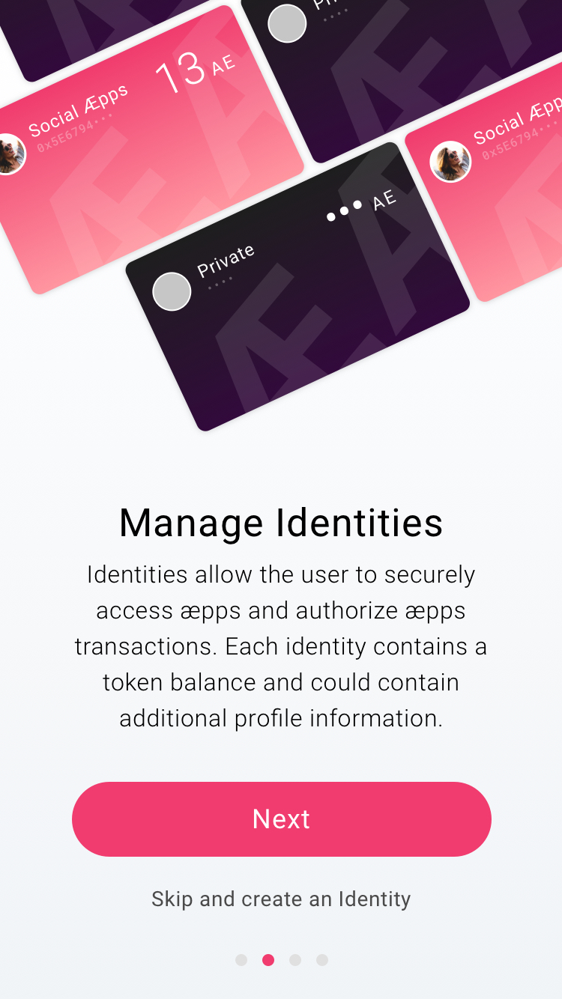

Intro Screen 2 explains that Identities can also be managed in the æternity manager

---

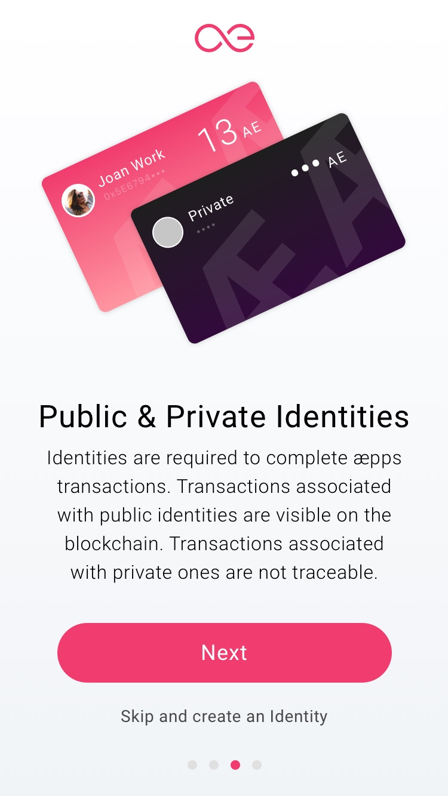

Intro Screen 3 explains the difference between Public & Private Identities

---

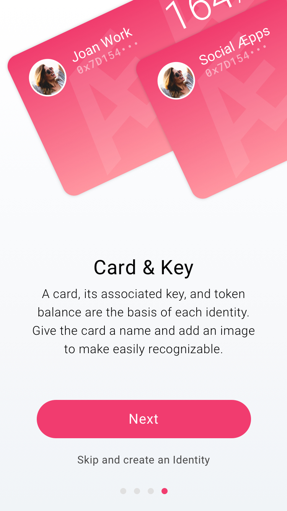

Intro Screen 4 explains the Key and the possibility to give them an alias

## Identity Creation
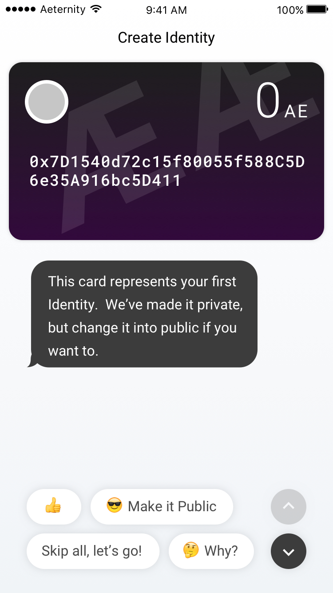

The onboarding starts, a private identity is pre-made for the user. The user sees it in the upper area of the screen. The lower area is a conversational interface. The first message from the app is that the card is made and that it’s private. The user is asked if he wants to leave it private, make it public, or leave everything and instantly go further and start using the app. Also a button is added for more information.

---

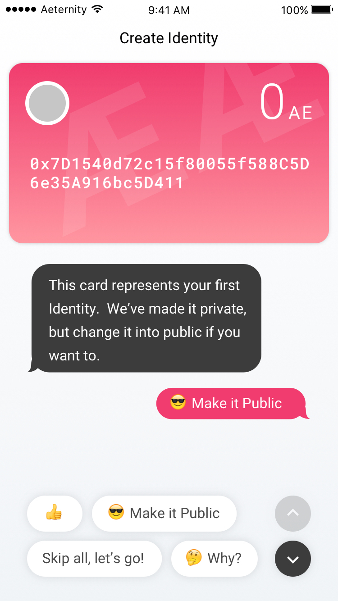

The User chooses “Make it Public”

---

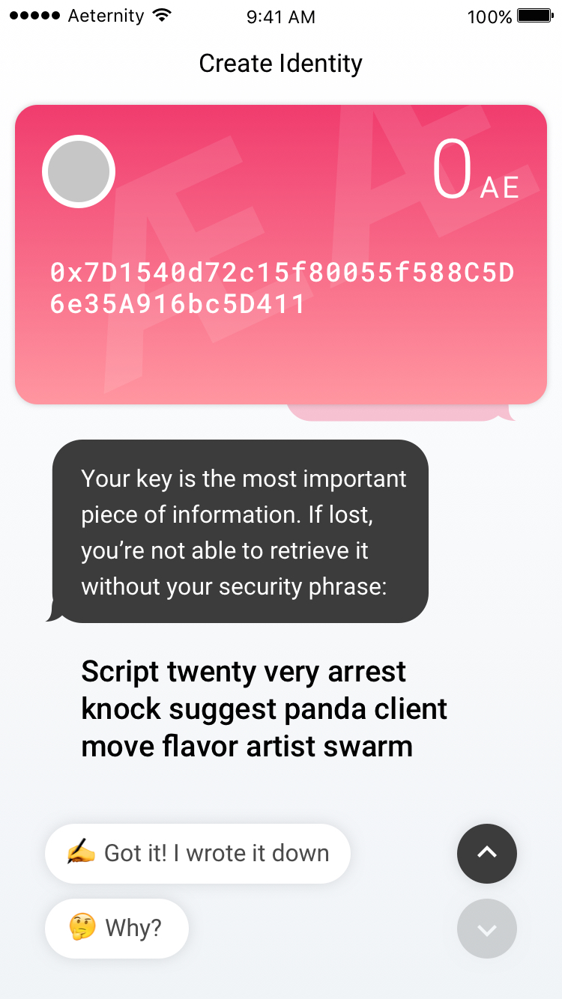

The key is explained, a security phrase if given and the user is prompted to write it down and confirm that he did.

---

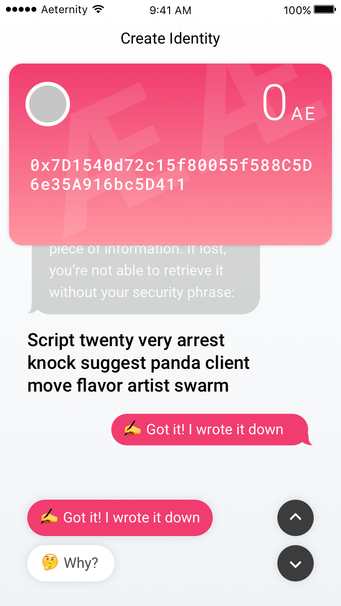

The user has confirmed that he has written it down

---

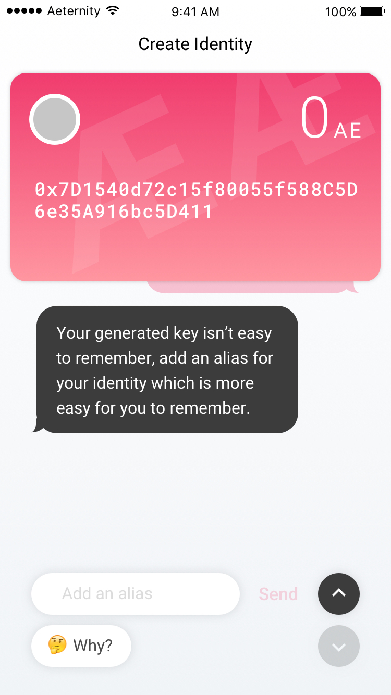

The user is given the option to add an alias in stead of the key.

---

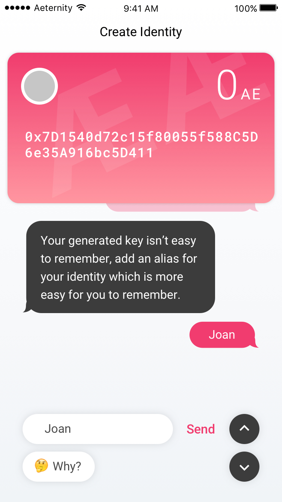

---

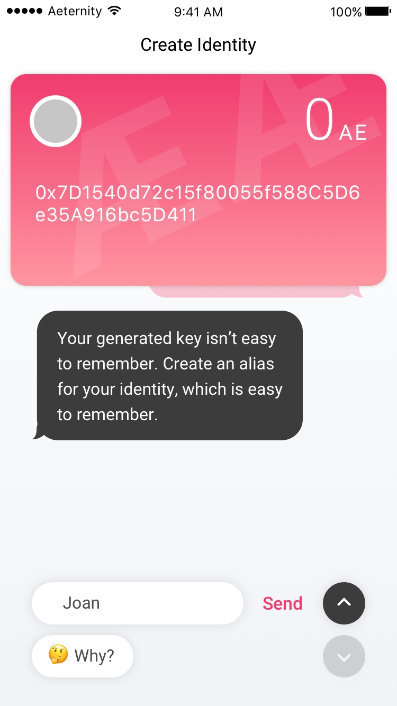

User adds an alias.

---

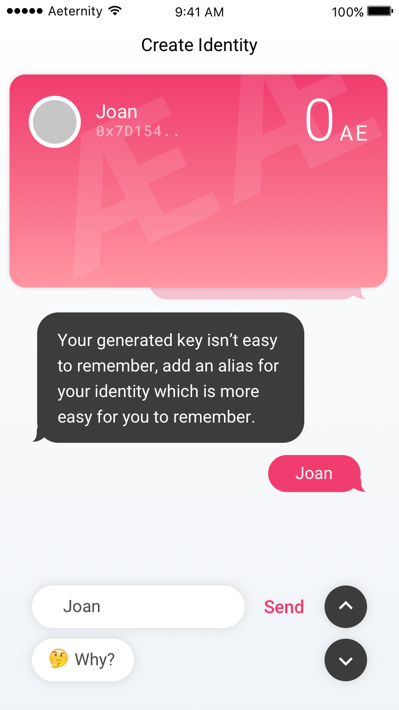

The card changes: key is more hidden, and the alias is more present.

---

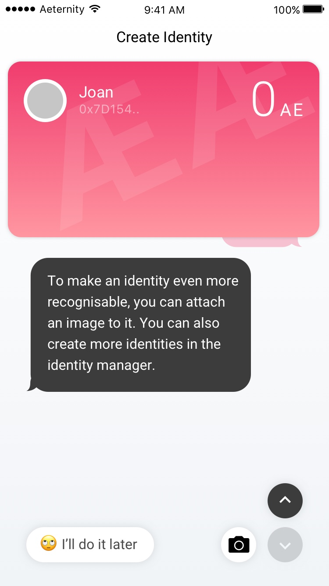

The user is being called by her name, to make in more personal. She is also asked to upload an image.

---

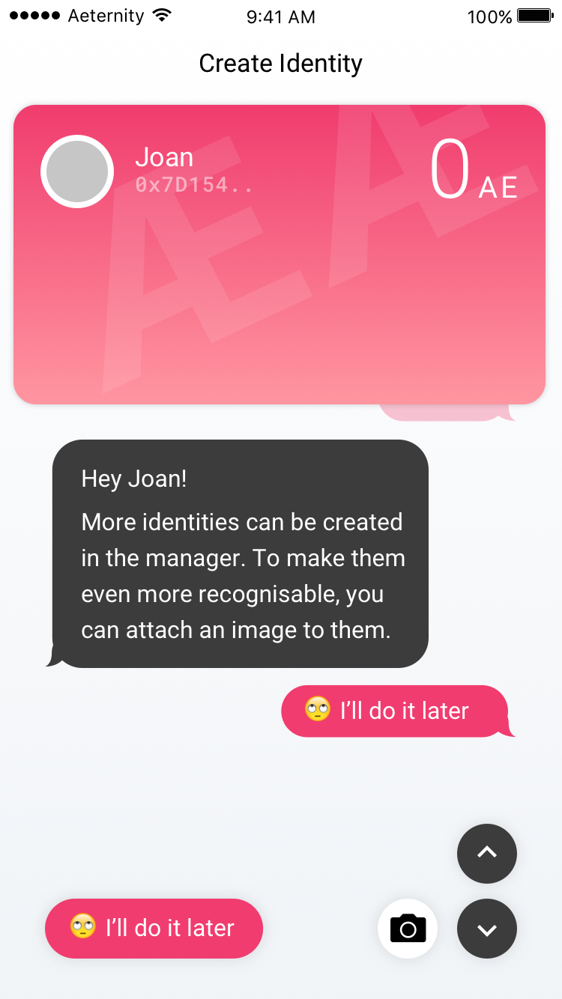

The user want to do it later.

---

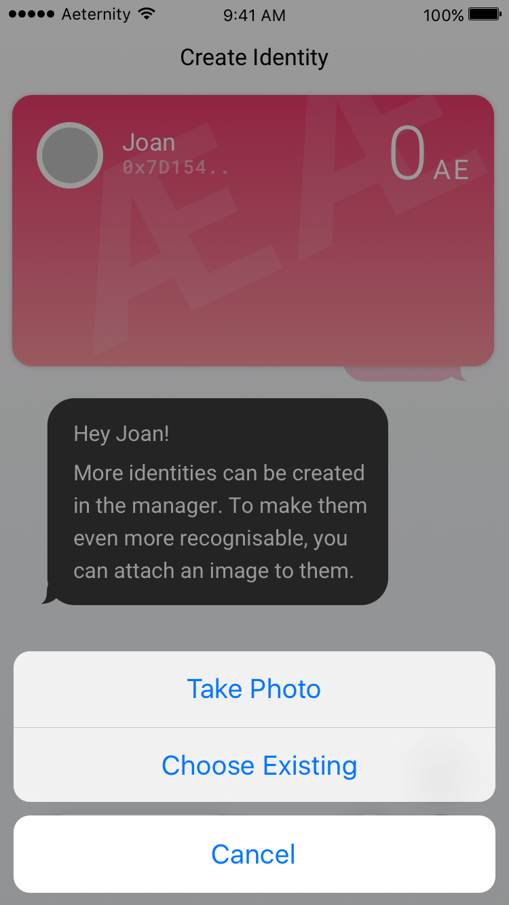

The user takes an image.

---

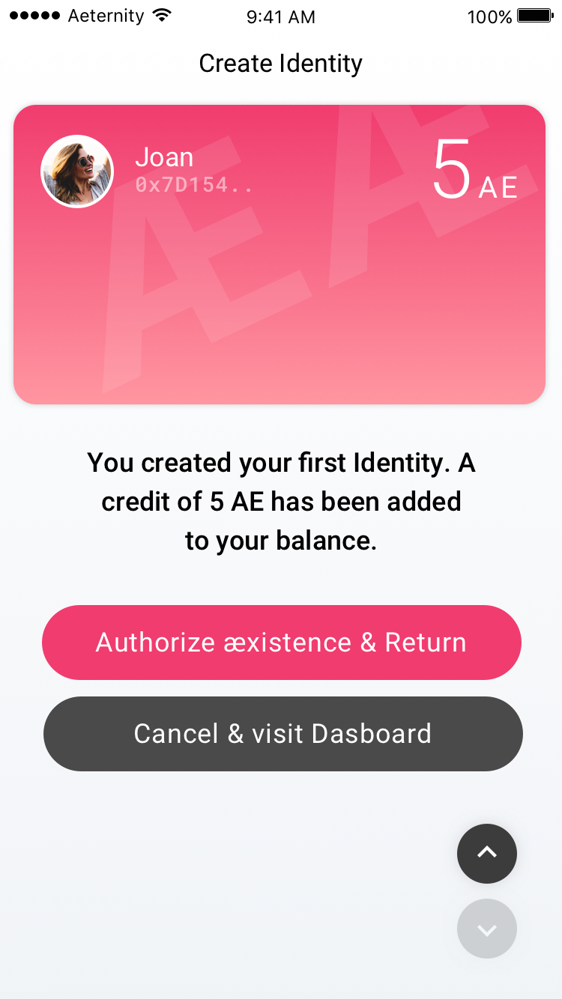

In the case that a user came from another æpp, the user is asked to authorise that from where he came from.

---

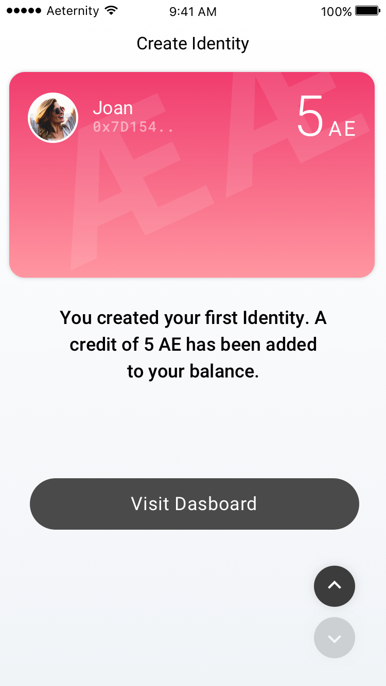

In the case that the user manually opened the Identity Manager, the user can visit the dashboard

## Next
[Jump to: Authorization](authorization.md)
