# Proof of Æxistence example

The user installed a æpp. In this case the Proof of Æxistence. This æpp 

## Intro
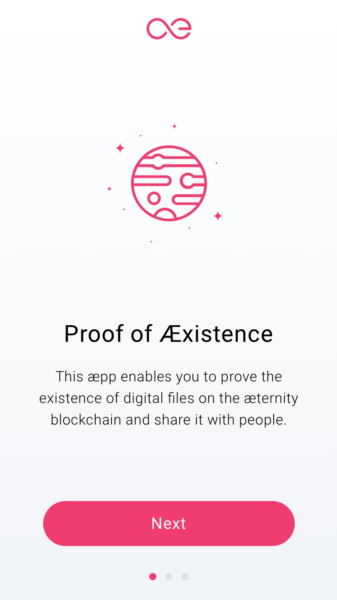

The Proof of æxistence is being explained.

---

A single Proof is being explained.

---

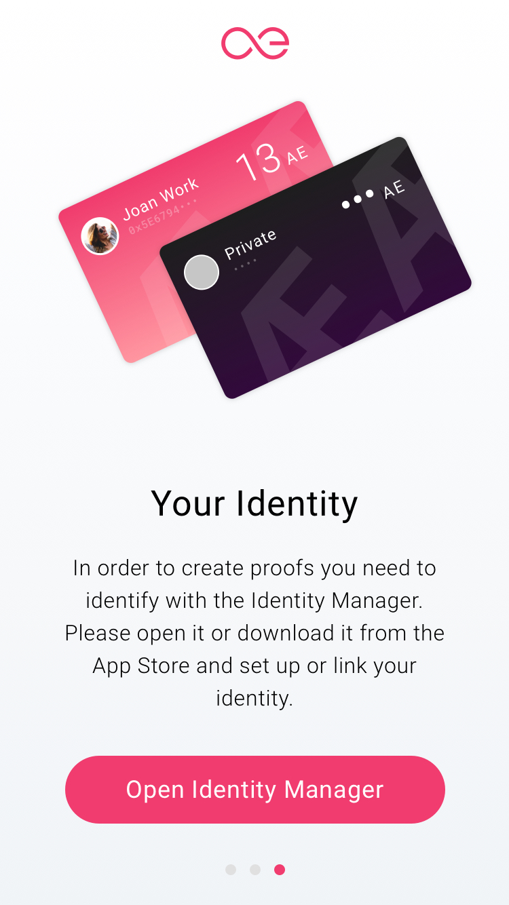

The user is asked to open the Identity Manager, this will lead to creating an Identity or pick an identity that is already been created.

## Authorize in Identity Manager

[Jump to: Authorization](authorization.md)

## Create a proof
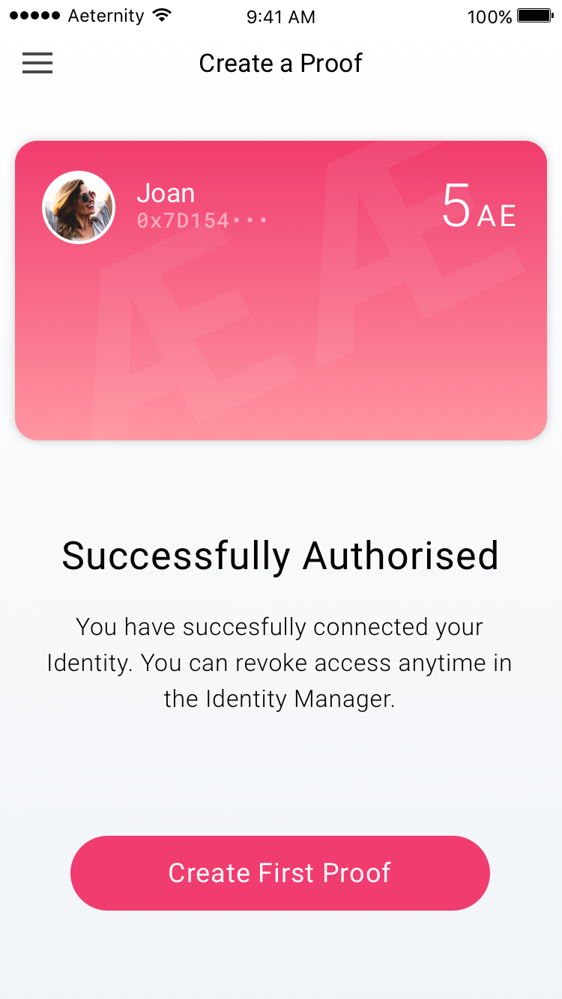

When the user has created an identity and/or authorised an existing one in the Identity Manager, she will come back to this screen. Where she is been informed that the authorisation has been successful.

---

A conversational interface askes the user to create her first proof. The option to create a proof with the camera or a file has been given. In an authorised æpp, the connecting identity is always shown in the bottom. Therefor, the user always knows which one is connected to this æpp.

---

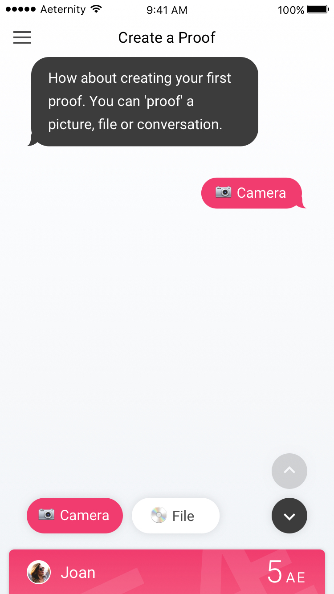

---

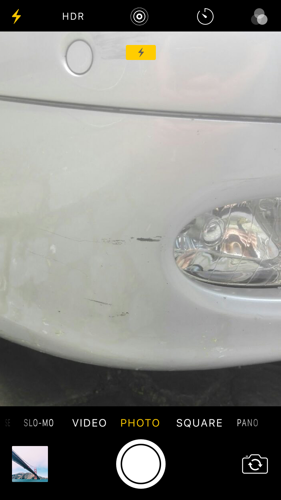

The camera has been chosen to create a proof.

---

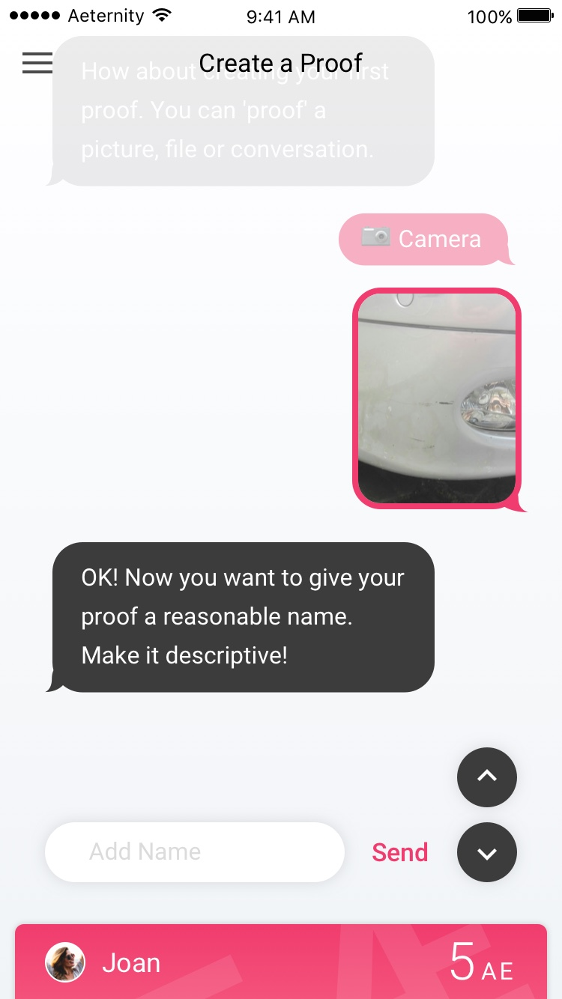

---

The app asked for the name of the proof, the user enters it.

---

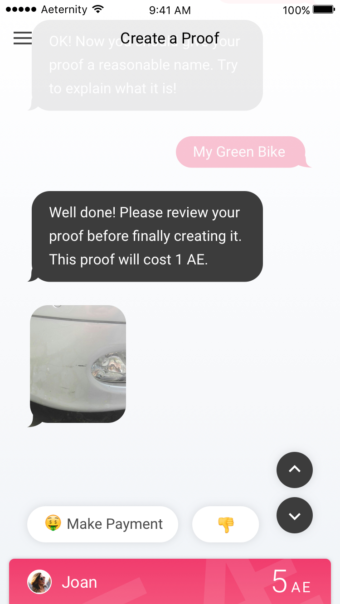

---

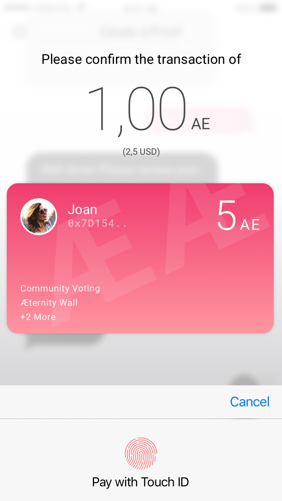

Creating a proof costs money, clicking on the make payment button will result in the active identity card to been shown completely and the user needs to confirm the payment with (for instance) the touch id security in ios.

---

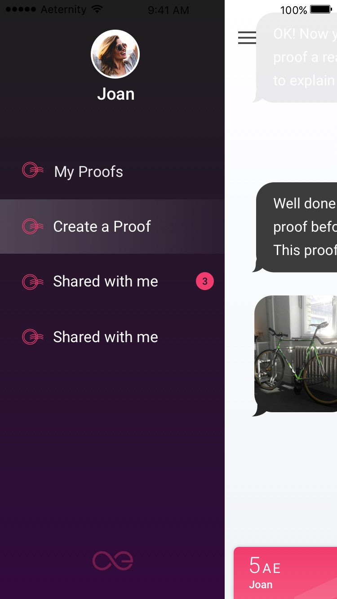

Sidemenu, Create a Proof is active

---

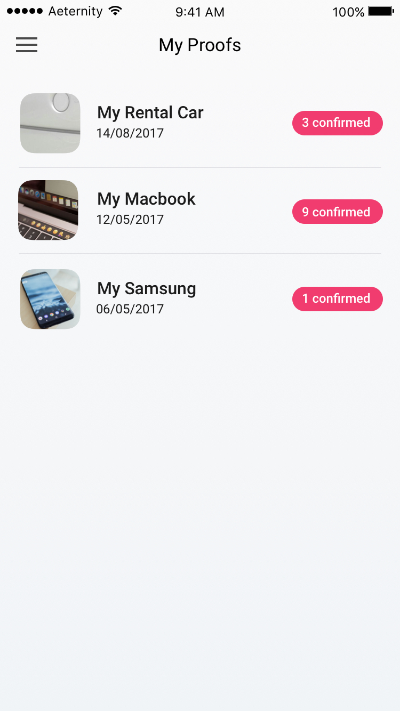

A list of all created proofs

---

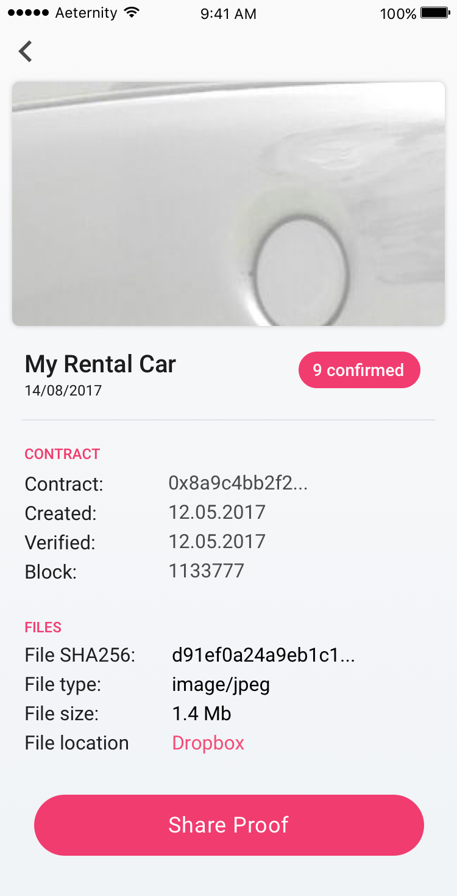

A detailed view of a proof. Here the user can see more information and share it with others to get more confirmations.

## Manage an aepp-authorization
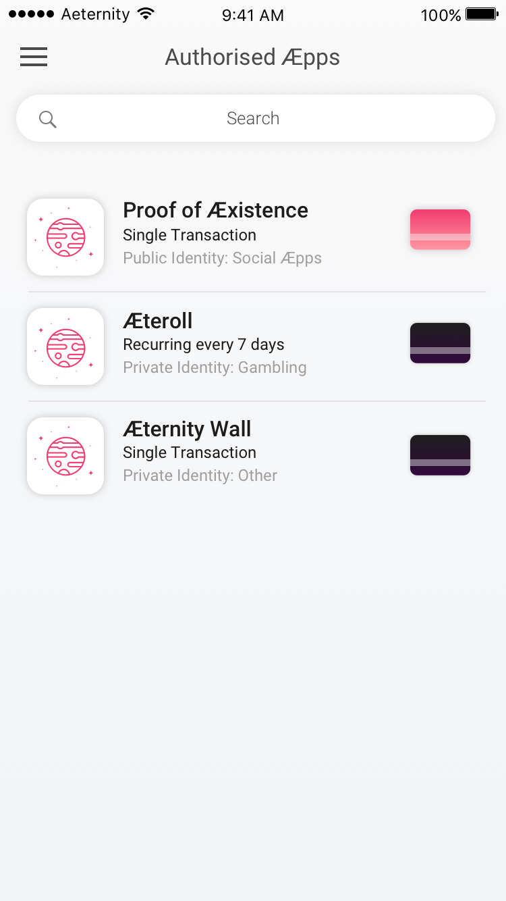

A list of all authorised æpps. Clicking on it shows details.

---

Sidemenu, Authorised æpps is active

---

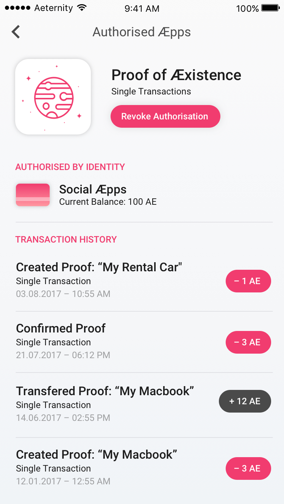

In this detail view the user sees the transactions that are made with the authorised æpp. The user has the option to revoke authorisation. It is the same view as 4.6.

## Next
[Jump to: Identity Management](identity-management.md)
