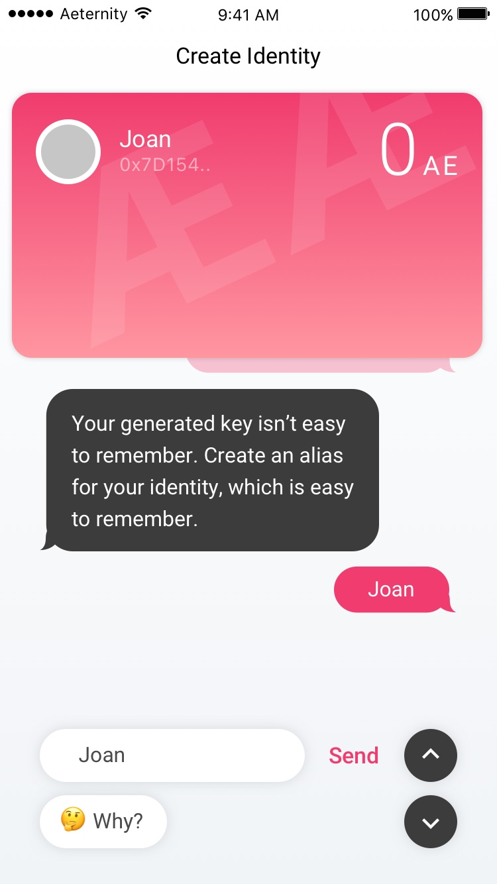

# Onboarding

Our goal is to provide access to provide frictionless access to the aeternity blockchain. Serving all necessary information for users who are not familiar with blockchain concepts. We also offer the user to skip this part and jump right into identity creation. We created a conversational interface to facilitate this.

## Intro
The intro screens explain the core concepts of identities on the æternity blockchain. The purpose of keys is explained as well as the option to give them an alias.

---

---

---

## Identity Creation

Users have to create at least one identity to interact with the æternity blockchain. From a technical point of view an identity is an address derived from an extended private key and might be connected to a profile and a public name. Profiles will be stored off chain.

The `Identity Creation` dialog provides an easy interface for beginners to set up their identites, without overwhelmeing them with technical information. Additional information can be requested by the user at any point (via the `Why?` button).

Experienced users are free to skip these explanations.

A private identity is pre-made. The user is asked if she wants to leave it private, make it public, or skip everything and start using the app immediately. If she decides to skip the onboarding, there will be reminders later to securely back up her mnemonic pass phrase.

---

---

Here the key is explained, a security phrase is given, the user is prompted to write the phrase down, and confirm that she did so.

---

Aliases are not public. They are just internal bookmarks to your address. Public identities can have public name and profile, which can be set up later. In this case this is the primary public identity the user creates, so she is choosing to use her first name.

---

The card changes: the alias is made prominent, while most of the key is hidden.

---

The user is asked to upload an image to personalize the public identity. Images are stored off chain.

---

---

In the case where the user manually opened the Identity Manager, she can go back to the dashboard.

## Next
[Jump to: Proof of Aexistence](proof-of-aexistence.md)
