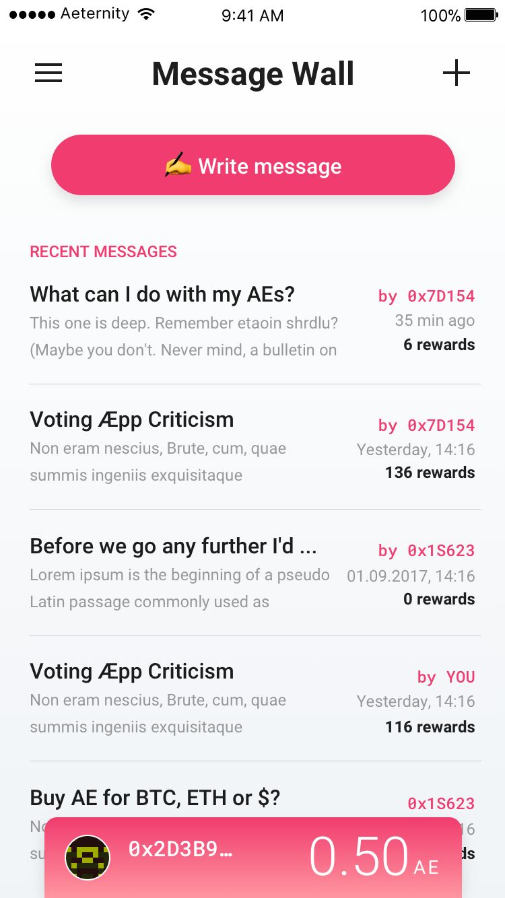
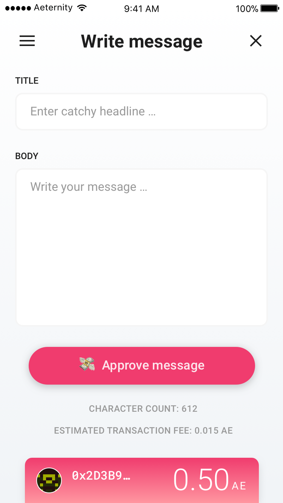
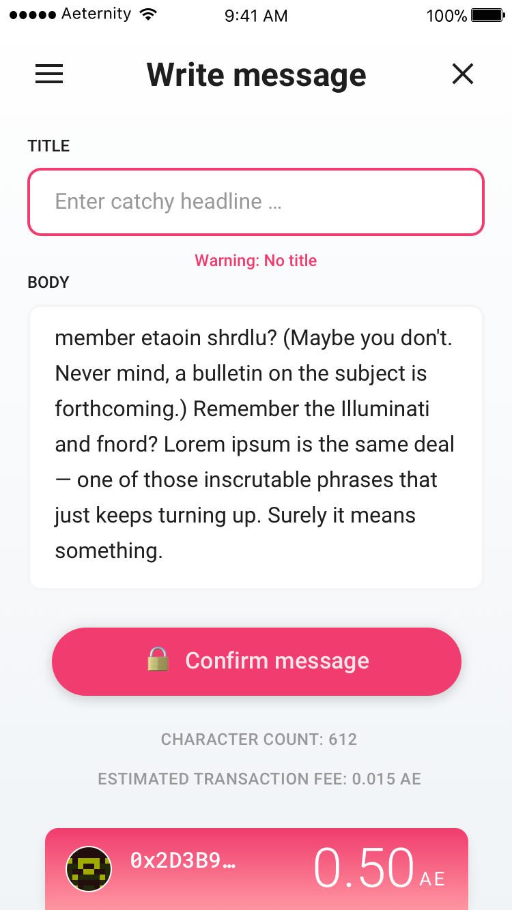
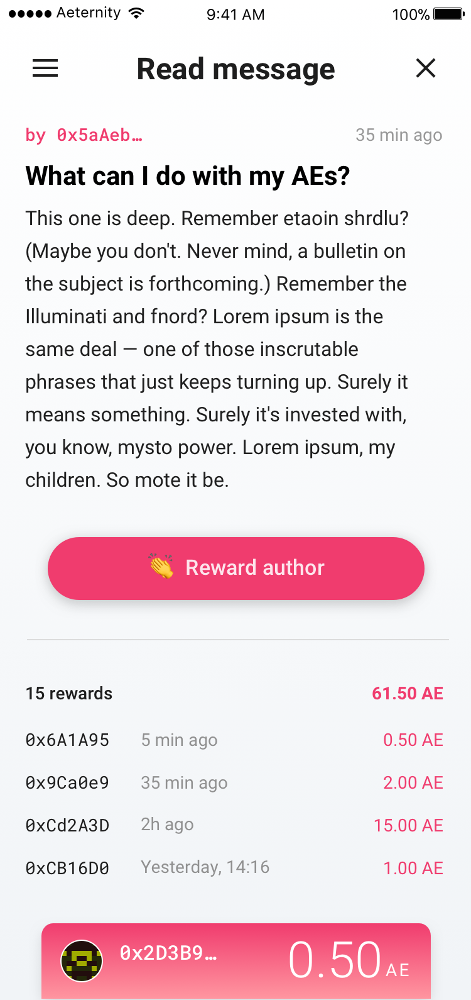

# Message Wall
Write and read and support æternal messages, thoughts and ideas.

## 💻 Browse the wall
The most recent messages are shown at the beginning, showing how often they have been rewarded by other users.  

## ✍ Write messages
A new message contains of a title and a bodytext. A counter shows how many characters the message uses and calculates the transaction costs to write the message into the blockchain.

---

If a field is empty, the user will we prompted with a warning.

## 🔒 Confirm messages
Every action to the blockchain is eternal and requires a micro payment. To authorize a transaction the screen needs to show the sender, the receiver and the requested amount of tokens. 

## 👏 Reward authors
Messages from other authors can be read in a clean interface. To show respect or thankfulness for the given information users can reward the author with a self set amount of tokens.

# Next
[Notary](notary.md)