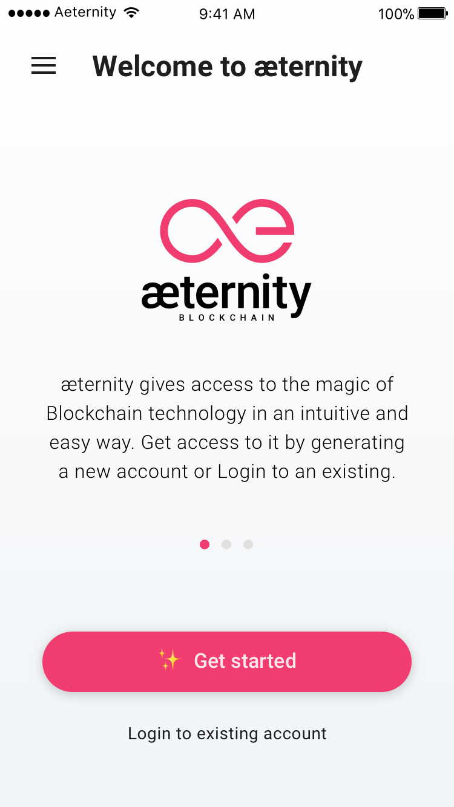
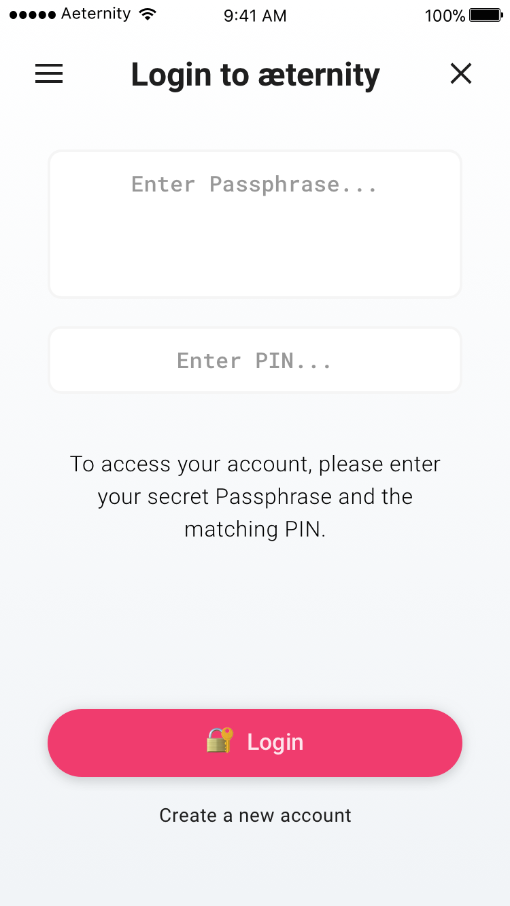
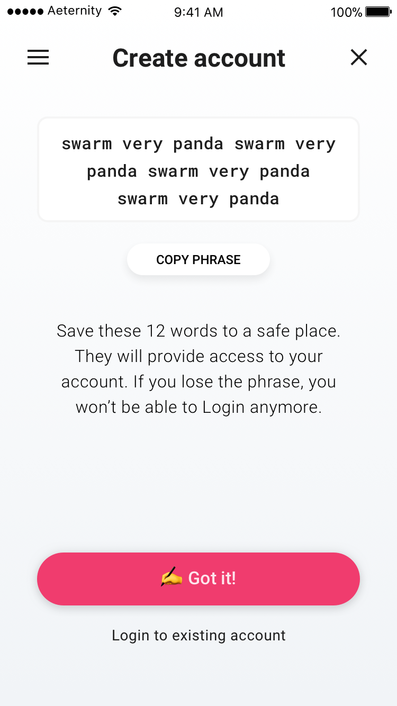
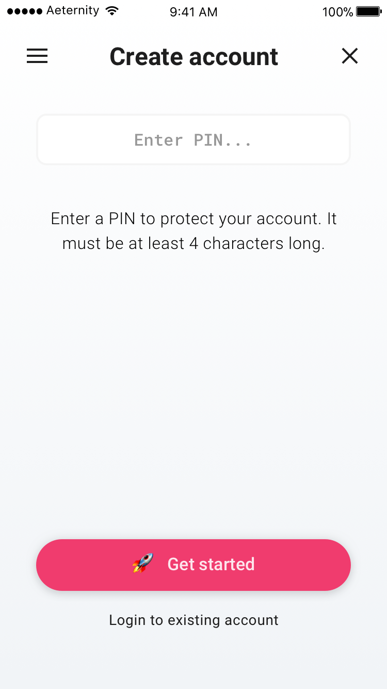
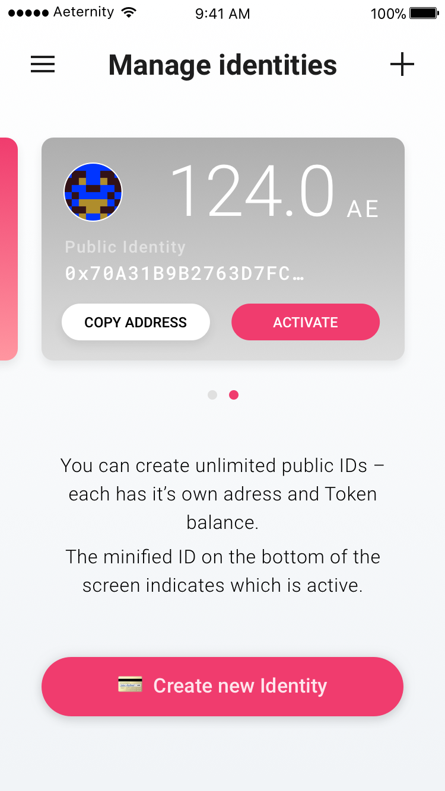
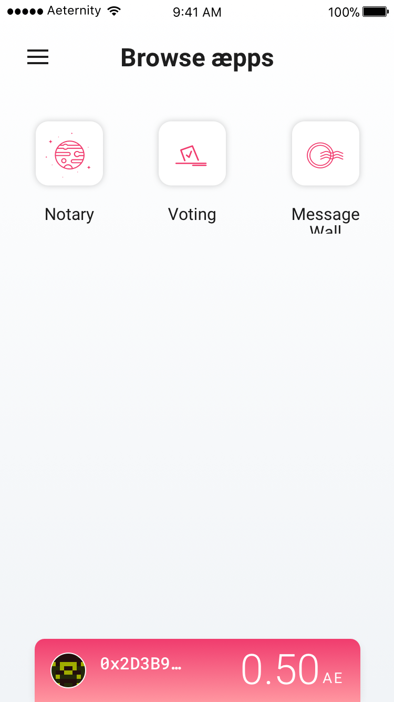
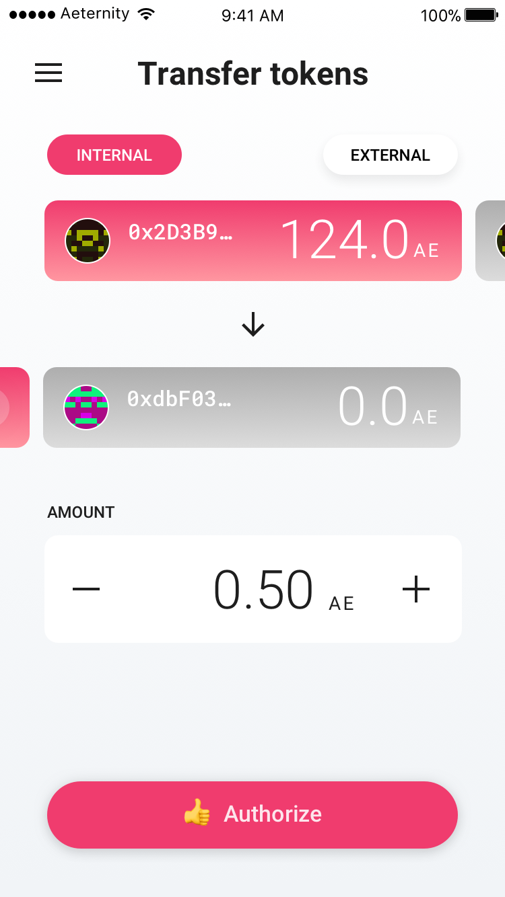
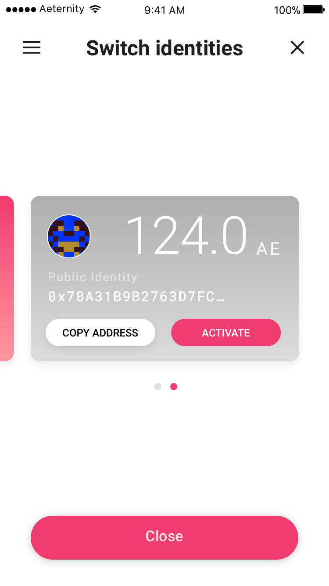
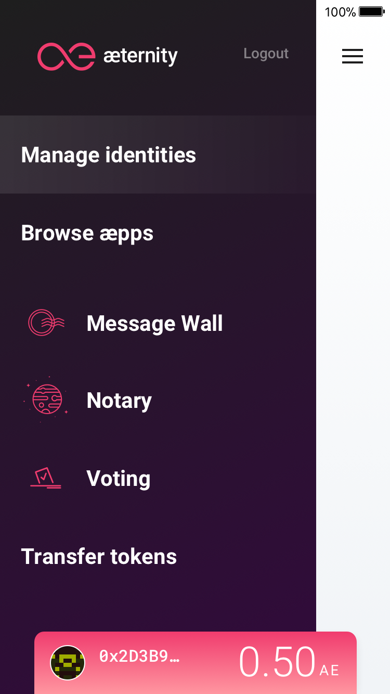

# Base æpp & Identity manager
Get in touch with the aeternity blockchain. 

## 🚀 Get started
Multiple intro screens explain the core concepts of the æternity blockchain. 

---

Users can login to an existing account through their secret passphrase and the connected PIN. 

## ✨ Create account
A security phrase is given, containing of 12 words, that the user is prompted to write down to a safe place, and confirm that he did so.

---

To protect the main account and to be able to recover it from a different device a PIN needs to be set.

## 💳 Manage identities
With the account creation a public ID is automatically created.  A public ID is an address derived from an extended private key. As long as there is only one ID, a hint is shown that a new ID can be created.

___

Multiple derived public IDs can be created – each with a own unique address and an own token balance. Only one can be active at a time – the grey card indicates an inactive ID.

## 👀 Aepp Browser
The user will be able to view all available æpps.

## 💸 Transfer tokens
Tokens can be transferred from one public ID to another.

## 🤞 Switch identities
The active ID can switched at anytime through an overlay.

## 🤳 Sidemenu
Users are always able to open the sidemenu to switch between the different functions of the base æpp or directly launch an æpp.

# Next
[Message Wall](wall.md)